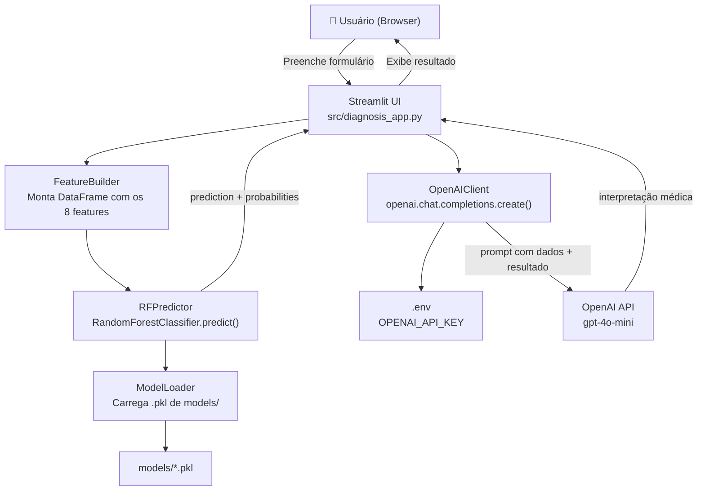
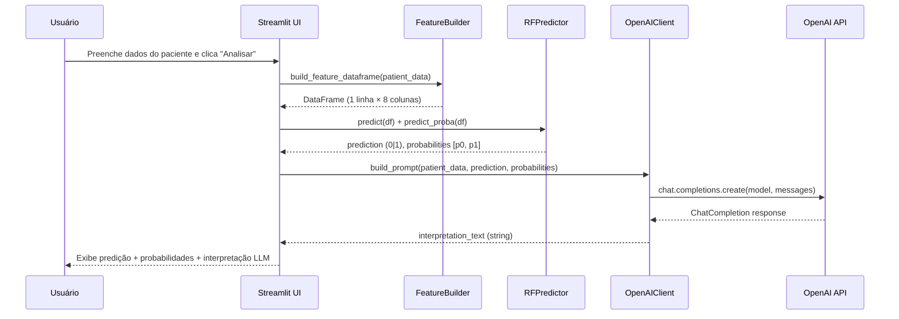
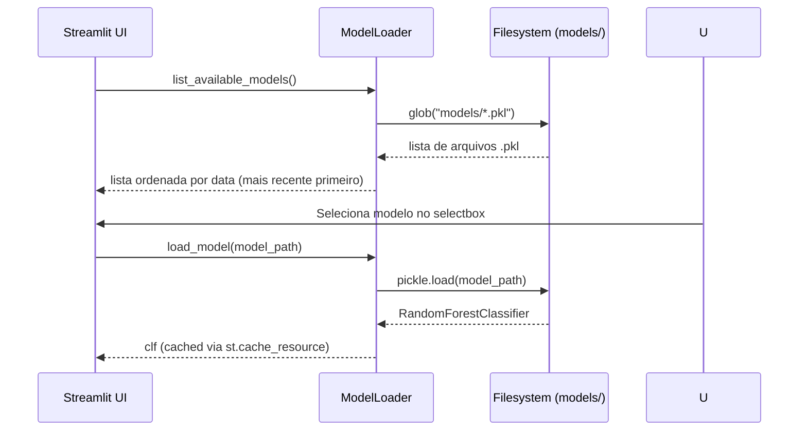

# Design Document: Diabetes Diagnosis Interface

## Overview

Interface Streamlit que permite ao usuário inserir dados clínicos de um paciente, obter uma predição do modelo RandomForest treinado (salvo em `models/`) e, em seguida, enviar os dados e o resultado da predição para a API da OpenAI, recebendo de volta uma interpretação médica contextualizada em linguagem natural.

A interface é um novo arquivo `src/diagnosis_app.py`, independente do dashboard GA existente (`src/app.py`), e reutiliza os modelos `.pkl` já gerados pelo pipeline de otimização. A chave da API OpenAI é carregada do arquivo `.env` via `python-dotenv`.

---

## Architecture



---

## Sequence Diagrams

### Fluxo Principal: Predição + Interpretação LLM



### Fluxo de Carregamento de Modelo



---

## Components and Interfaces

### Component 1: ModelLoader

**Purpose**: Descobrir, listar e carregar modelos `.pkl` do diretório `models/`.

**Interface**:
```python
def list_available_models(models_dir: str) -> list[tuple[str, str]]:
    """
    Retorna lista de tuplas (label_exibição, caminho_absoluto)
    ordenada do mais recente para o mais antigo.
    Ex: [("model_diabetes_rf_optimized_2603182045 (otimizado)", "/abs/path/...pkl"), ...]
    """

@st.cache_resource
def load_model(model_path: str) -> RandomForestClassifier:
    """
    Carrega e retorna o modelo pickle. Cacheado pelo Streamlit
    para evitar recarregamentos entre re-renders.
    Raises: FileNotFoundError se o arquivo não existir.
    """
```

**Responsibilities**:
- Varrer `models/` com `glob` para encontrar todos os `.pkl`
- Ordenar por timestamp no nome do arquivo (mais recente primeiro)
- Distinguir modelos "otimizados" de "original" no label de exibição
- Cachear o modelo carregado com `@st.cache_resource`

---

### Component 2: FeatureBuilder

**Purpose**: Converter os valores inseridos pelo usuário no formulário em um `pd.DataFrame` com as colunas exatas esperadas pelo modelo.

**Interface**:
```python
FEATURE_COLUMNS: list[str] = [
    "Pregnancies", "Glucose", "BloodPressure", "SkinThickness",
    "Insulin", "BMI", "DiabetesPedigreeFunction", "Age"
]

def build_feature_dataframe(patient_data: dict[str, float]) -> pd.DataFrame:
    """
    Recebe dicionário {feature_name: value} e retorna DataFrame
    de 1 linha com as colunas na ordem correta para o modelo.
    Raises: ValueError se alguma feature obrigatória estiver ausente.
    """
```

**Responsibilities**:
- Garantir a ordem correta das colunas (mesma do treinamento)
- Validar que todos os 8 features estão presentes
- Retornar DataFrame com dtype float64

---

### Component 3: RFPredictor

**Purpose**: Executar a predição e obter probabilidades usando o modelo carregado.

**Interface**:
```python
def predict_diabetes(
    clf: RandomForestClassifier,
    feature_df: pd.DataFrame
) -> PredictionResult:
    """
    Executa predict() e predict_proba() no modelo.
    Retorna PredictionResult com predição binária e probabilidades.
    """
```

**Data Model — PredictionResult**:
```python
from dataclasses import dataclass

@dataclass
class PredictionResult:
    prediction: int          # 0 = não diabético, 1 = diabético
    probability_negative: float  # P(Outcome=0)
    probability_positive: float  # P(Outcome=1)
    label: str               # "Diabético" | "Não Diabético"
    confidence: float        # max(probability_negative, probability_positive)
```

**Responsibilities**:
- Chamar `clf.predict(df)` e `clf.predict_proba(df)`
- Montar e retornar o `PredictionResult`
- Não lançar exceções de negócio — erros de modelo são propagados

---

### Component 4: OpenAIClient

**Purpose**: Construir o prompt com os dados do paciente e o resultado da predição, enviar para a API OpenAI e retornar a interpretação em texto.

**Interface**:
```python
def build_diagnosis_prompt(
    patient_data: dict[str, float],
    result: PredictionResult
) -> str:
    """
    Monta o prompt do usuário (user message) com os dados clínicos
    e o resultado da predição do modelo RF.
    """

def get_llm_interpretation(
    patient_data: dict[str, float],
    result: PredictionResult,
    api_key: str,
    model: str = "gpt-4o-mini"
) -> str:
    """
    Envia o prompt para a OpenAI e retorna o texto de interpretação.
    Raises: openai.OpenAIError em caso de falha na API.
    """
```

**Responsibilities**:
- Carregar `OPENAI_API_KEY` do ambiente (via `python-dotenv`)
- Construir system prompt com contexto médico e instruções de tom
- Construir user prompt com dados clínicos estruturados + resultado RF
- Chamar `openai.chat.completions.create()` com streaming opcional
- Retornar o texto da resposta (`choices[0].message.content`)

---

### Component 5: DiagnosisUI (Streamlit App)

**Purpose**: Orquestrar todos os componentes acima em uma interface Streamlit coesa.

**Responsibilities**:
- Renderizar sidebar com seleção de modelo
- Renderizar formulário com sliders/number_inputs para os 8 features
- Acionar predição ao clicar "Analisar"
- Exibir resultado da predição com métricas visuais (gauge/metric)
- Acionar interpretação LLM e exibir com `st.markdown` (streaming)
- Tratar erros de API Key ausente e falhas de rede com `st.error`

---

## Data Models

### PatientData

```python
# Valores de referência do dataset diabetes_treated.csv
@dataclass
class PatientData:
    Pregnancies: float           # int, 0–17
    Glucose: float               # mg/dL, 44–199
    BloodPressure: float         # mm Hg, 24–122
    SkinThickness: float         # mm, 7–99
    Insulin: float               # μU/mL, 14–846 (imputado: ~79.8)
    BMI: float                   # kg/m², 18.2–67.1
    DiabetesPedigreeFunction: float  # 0.078–2.42
    Age: float                   # anos, 21–81
```

**Validation Rules**:
- Todos os campos são obrigatórios
- Valores numéricos dentro dos intervalos observados no dataset (usados como limites dos sliders)
- `Glucose` > 0 (valor 0 é clinicamente inválido — já tratado no dataset)
- `BMI` > 0

### PredictionResult (ver Component 3 acima)

### LLMResponse

```python
@dataclass
class LLMResponse:
    interpretation: str   # texto completo retornado pela OpenAI
    model_used: str       # ex: "gpt-4o-mini"
    tokens_used: int      # total_tokens do usage
```

---

## Algorithmic Pseudocode

### Algoritmo Principal: Fluxo de Diagnóstico

```pascal
ALGORITHM run_diagnosis(patient_data, selected_model_path, api_key)
INPUT:  patient_data: dict[str, float]
        selected_model_path: str
        api_key: str
OUTPUT: diagnosis_output: dict com prediction, probabilities, interpretation

BEGIN
  // Pré-condições
  ASSERT patient_data contém todos os 8 features
  ASSERT selected_model_path é um arquivo .pkl válido
  ASSERT api_key não é vazia

  // Etapa 1: Carregar modelo
  clf ← load_model(selected_model_path)   // cacheado

  // Etapa 2: Construir DataFrame de features
  feature_df ← build_feature_dataframe(patient_data)
  ASSERT feature_df.shape = (1, 8)

  // Etapa 3: Predição RF
  result ← predict_diabetes(clf, feature_df)
  ASSERT result.prediction IN {0, 1}
  ASSERT 0.0 ≤ result.probability_positive ≤ 1.0
  ASSERT result.probability_negative + result.probability_positive ≈ 1.0

  // Etapa 4: Interpretação LLM
  interpretation ← get_llm_interpretation(patient_data, result, api_key)
  ASSERT interpretation não é vazia

  RETURN {
    prediction: result.prediction,
    probability_positive: result.probability_positive,
    probability_negative: result.probability_negative,
    label: result.label,
    interpretation: interpretation
  }
END
```

### Algoritmo: Construção do Prompt LLM

```pascal
ALGORITHM build_diagnosis_prompt(patient_data, result)
INPUT:  patient_data: dict[str, float]
        result: PredictionResult
OUTPUT: messages: list[dict]  // formato OpenAI chat

BEGIN
  system_message ← """
    Você é um assistente médico especializado em diabetes.
    Analise os dados clínicos fornecidos e o resultado de um modelo de
    machine learning (RandomForest) treinado no dataset Pima Indians Diabetes.
    Forneça uma interpretação clara, em português, sobre o risco de diabetes
    do paciente. Destaque os fatores de risco mais relevantes com base nos
    valores fornecidos. Inclua recomendações gerais de acompanhamento médico.
    IMPORTANTE: Deixe claro que esta é uma análise auxiliar e não substitui
    consulta médica profissional.
  """

  prediction_label ← IF result.prediction = 1 THEN "POSITIVO para diabetes"
                     ELSE "NEGATIVO para diabetes"

  user_message ← CONCAT(
    "Dados clínicos do paciente:\n",
    "- Gestações: ", patient_data["Pregnancies"], "\n",
    "- Glicose: ", patient_data["Glucose"], " mg/dL\n",
    "- Pressão arterial: ", patient_data["BloodPressure"], " mm Hg\n",
    "- Espessura da pele (tríceps): ", patient_data["SkinThickness"], " mm\n",
    "- Insulina: ", patient_data["Insulin"], " μU/mL\n",
    "- IMC: ", patient_data["BMI"], " kg/m²\n",
    "- Função pedigree de diabetes: ", patient_data["DiabetesPedigreeFunction"], "\n",
    "- Idade: ", patient_data["Age"], " anos\n\n",
    "Resultado do modelo RandomForest: ", prediction_label, "\n",
    "Probabilidade de diabetes: ", FORMAT(result.probability_positive * 100, ".1f"), "%\n",
    "Probabilidade de não diabetes: ", FORMAT(result.probability_negative * 100, ".1f"), "%\n\n",
    "Por favor, forneça uma interpretação médica detalhada deste resultado."
  )

  RETURN [
    {"role": "system", "content": system_message},
    {"role": "user",   "content": user_message}
  ]
END
```

### Algoritmo: Listagem e Ordenação de Modelos

```pascal
ALGORITHM list_available_models(models_dir)
INPUT:  models_dir: str  // caminho para models/
OUTPUT: model_list: list[tuple[str, str]]  // (label, path)

BEGIN
  pkl_files ← glob(models_dir + "/*.pkl")

  IF pkl_files IS EMPTY THEN
    RETURN []
  END IF

  model_list ← []
  FOR each file IN pkl_files DO
    filename ← basename(file)
    IF "optimized" IN filename THEN
      label ← filename + " (otimizado)"
    ELSE
      label ← filename + " (original)"
    END IF
    model_list.append((label, file))
  END FOR

  // Ordena por nome de arquivo (timestamp embutido) — mais recente primeiro
  model_list ← SORT(model_list, key=filename, order=DESCENDING)

  RETURN model_list
END
```

---

## Key Functions with Formal Specifications

### `load_model(model_path)`

```python
@st.cache_resource
def load_model(model_path: str) -> RandomForestClassifier
```

**Preconditions:**
- `model_path` é uma string não vazia
- O arquivo em `model_path` existe e é um pickle válido de `RandomForestClassifier`

**Postconditions:**
- Retorna instância de `RandomForestClassifier` com `feature_names_in_` definido
- O resultado é cacheado: chamadas subsequentes com o mesmo `model_path` retornam o mesmo objeto
- Não modifica o sistema de arquivos

**Loop Invariants:** N/A

---

### `build_feature_dataframe(patient_data)`

```python
def build_feature_dataframe(patient_data: dict[str, float]) -> pd.DataFrame
```

**Preconditions:**
- `patient_data` contém exatamente as 8 chaves de `FEATURE_COLUMNS`
- Todos os valores são numéricos (int ou float)

**Postconditions:**
- Retorna `pd.DataFrame` com `shape == (1, 8)`
- Colunas estão na ordem exata de `FEATURE_COLUMNS`
- Todos os valores são `float64`
- Não modifica `patient_data`

**Loop Invariants:** N/A

---

### `predict_diabetes(clf, feature_df)`

```python
def predict_diabetes(clf: RandomForestClassifier, feature_df: pd.DataFrame) -> PredictionResult
```

**Preconditions:**
- `clf` é um `RandomForestClassifier` treinado e carregado
- `feature_df.shape == (1, 8)` com colunas na ordem correta

**Postconditions:**
- `result.prediction ∈ {0, 1}`
- `0.0 ≤ result.probability_negative ≤ 1.0`
- `0.0 ≤ result.probability_positive ≤ 1.0`
- `abs(result.probability_negative + result.probability_positive - 1.0) < 1e-6`
- `result.label == "Diabético"` se `result.prediction == 1`, senão `"Não Diabético"`
- `result.confidence == max(result.probability_negative, result.probability_positive)`

**Loop Invariants:** N/A

---

### `get_llm_interpretation(patient_data, result, api_key, model)`

```python
def get_llm_interpretation(
    patient_data: dict[str, float],
    result: PredictionResult,
    api_key: str,
    model: str = "gpt-4o-mini"
) -> str
```

**Preconditions:**
- `api_key` é uma string não vazia e válida para a OpenAI API
- `patient_data` contém os 8 features com valores numéricos
- `result` é um `PredictionResult` válido
- `model` é um identificador de modelo OpenAI válido

**Postconditions:**
- Retorna string não vazia com a interpretação médica
- Não modifica `patient_data` nem `result`
- Em caso de falha na API: lança `openai.OpenAIError` (tratado pela UI com `st.error`)

**Loop Invariants:** N/A

---

## Example Usage

```python
# Exemplo de uso completo (equivalente ao que a UI executa ao clicar "Analisar")

import os
import pickle
import pandas as pd
from dotenv import load_dotenv

load_dotenv()
api_key = os.getenv("OPENAI_API_KEY")

# 1. Carregar modelo
with open("models/model_diabetes_rf_optimized_2603182045.pkl", "rb") as f:
    clf = pickle.load(f)

# 2. Dados do paciente
patient_data = {
    "Pregnancies": 2,
    "Glucose": 148.0,
    "BloodPressure": 72.0,
    "SkinThickness": 35.0,
    "Insulin": 79.8,
    "BMI": 33.6,
    "DiabetesPedigreeFunction": 0.627,
    "Age": 50
}

# 3. Construir DataFrame
feature_df = pd.DataFrame([patient_data])[FEATURE_COLUMNS]

# 4. Predição
prediction = clf.predict(feature_df)[0]          # 1
probabilities = clf.predict_proba(feature_df)[0]  # [0.23, 0.77]

result = PredictionResult(
    prediction=prediction,
    probability_negative=probabilities[0],
    probability_positive=probabilities[1],
    label="Diabético" if prediction == 1 else "Não Diabético",
    confidence=max(probabilities)
)

# 5. Interpretação LLM
interpretation = get_llm_interpretation(patient_data, result, api_key)
print(interpretation)
# → "Com base nos dados clínicos fornecidos, o modelo RandomForest indica
#    um resultado POSITIVO para diabetes com 77% de probabilidade. Os
#    principais fatores de risco identificados são: nível de glicose
#    elevado (148 mg/dL), IMC acima do ideal (33.6 kg/m²) e histórico
#    familiar relevante (pedigree 0.627)..."
```

---

## Correctness Properties

*A property is a characteristic or behavior that should hold true across all valid executions of a system — essentially, a formal statement about what the system should do. Properties serve as the bridge between human-readable specifications and machine-verifiable correctness guarantees.*

### Property 1: Conservação de probabilidades

*For any* valid feature DataFrame input, the sum of `probability_negative` and `probability_positive` in the returned `PredictionResult` must equal `1.0` within a numerical tolerance of `1e-6`.

**Validates: Requirements 4.2**

---

### Property 2: Consistência label/prediction

*For any* valid feature DataFrame input, `result.label` must equal `"Diabético"` if and only if `result.prediction` equals `1`; otherwise `result.label` must equal `"Não Diabético"`.

**Validates: Requirements 4.3**

---

### Property 3: Consistência confidence

*For any* valid feature DataFrame input, `result.confidence` must equal `max(result.probability_negative, result.probability_positive)`.

**Validates: Requirements 4.4**

---

### Property 4: Ordem e shape do DataFrame de features

*For any* valid `patient_data` dictionary containing all 8 required features with numeric values, `build_feature_dataframe(patient_data)` must return a DataFrame with shape `(1, 8)`, columns in the exact order of `FEATURE_COLUMNS`, and all values as `float64` dtype.

**Validates: Requirements 3.2, 3.3**

---

### Property 5: Ordenação de modelos por nome de arquivo

*For any* non-empty set of `.pkl` filenames in the `models/` directory, `list_available_models()` must return them ordered by filename in descending lexicographic order (most recent timestamp first).

**Validates: Requirements 2.1**

---

### Property 6: Rotulagem de modelos

*For any* `.pkl` filename, `list_available_models()` must append `"(otimizado)"` to the display label if the filename contains `"optimized"`, and `"(original)"` otherwise.

**Validates: Requirements 2.3**

---

### Property 7: Estrutura do prompt LLM

*For any* valid `patient_data` dictionary and `PredictionResult`, `build_diagnosis_prompt(patient_data, result)` must return a list of exactly 2 dictionaries, each containing non-empty `"role"` and `"content"` keys, with roles `"system"` and `"user"` respectively.

**Validates: Requirements 5.1**

---

### Property 8: Completude do prompt — dados clínicos e resultado

*For any* valid `patient_data` and `PredictionResult`, the `"user"` message content produced by `build_diagnosis_prompt` must contain the string representation of all 8 clinical feature values from `patient_data`, the prediction label, and the formatted probability values.

**Validates: Requirements 5.2, 5.3**

---

### Property 9: Idempotência do cache de modelo

*For any* valid model path, calling `load_model(path)` multiple times within the same Streamlit session must return the identical object instance (same Python object identity), confirming that deserialization occurs only once.

**Validates: Requirements 2.4**

---

## Error Handling

### Cenário 1: OPENAI_API_KEY ausente ou inválida

**Condição**: `.env` não contém `OPENAI_API_KEY` ou a chave é inválida  
**Resposta**: `st.error("⚠️ OPENAI_API_KEY não encontrada. Adicione ao arquivo .env.")` — bloco de interpretação LLM não é exibido  
**Recuperação**: Usuário adiciona a chave ao `.env` e reinicia o app

### Cenário 2: Nenhum modelo .pkl encontrado

**Condição**: Diretório `models/` está vazio ou não existe  
**Resposta**: `st.warning("Nenhum modelo encontrado em models/. Execute o AG primeiro.")` — botão "Analisar" desabilitado  
**Recuperação**: Usuário executa `streamlit run src/app.py` para gerar um modelo

### Cenário 3: Falha na API OpenAI (timeout, rate limit, erro de rede)

**Condição**: `openai.OpenAIError` lançado durante `chat.completions.create()`  
**Resposta**: `st.error(f"Erro ao consultar OpenAI: {str(e)}")` — predição RF ainda é exibida  
**Recuperação**: Usuário pode tentar novamente; predição local permanece disponível

### Cenário 4: Arquivo .pkl corrompido ou incompatível

**Condição**: `pickle.load()` lança exceção (arquivo corrompido, versão incompatível do sklearn)  
**Resposta**: `st.error(f"Erro ao carregar modelo: {str(e)}")` — seletor de modelo permanece ativo  
**Recuperação**: Usuário seleciona outro modelo disponível

---

## Testing Strategy

### Unit Testing Approach

Testar cada componente isoladamente com `pytest`:

- `test_build_feature_dataframe`: verifica shape, ordem de colunas e dtype
- `test_predict_diabetes`: usa modelo mock (ou modelo real carregado) para verificar invariantes de `PredictionResult`
- `test_build_diagnosis_prompt`: verifica estrutura das mensagens (system + user), presença dos dados do paciente e do resultado no prompt
- `test_list_available_models`: usa diretório temporário com arquivos `.pkl` fictícios para verificar ordenação e labels

### Property-Based Testing Approach

**Property Test Library**: `hypothesis`

Propriedades a testar:
- Para qualquer `patient_data` com valores dentro dos intervalos válidos, `build_feature_dataframe` sempre retorna DataFrame com shape `(1, 8)` e colunas corretas
- Para qualquer `PredictionResult` válido, `probability_negative + probability_positive ≈ 1.0`
- Para qualquer `patient_data` e `result`, `build_diagnosis_prompt` retorna lista de 2 dicts com chaves `"role"` e `"content"` não vazias

### Integration Testing Approach

- Teste end-to-end com modelo real carregado de `models/model_diabetes_rf_original.pkl`
- Verificar que o pipeline completo (load → build_df → predict → build_prompt) não lança exceções para entradas válidas
- Teste de integração com OpenAI API (marcado como `@pytest.mark.integration`, requer `OPENAI_API_KEY` no ambiente)

---

## Performance Considerations

- **Cache de modelo**: `@st.cache_resource` garante que o `.pkl` é desserializado apenas uma vez por sessão, independente de quantas predições são feitas
- **Latência da API OpenAI**: A chamada à OpenAI é a operação mais lenta (~1–5s). Usar `st.spinner("Consultando OpenAI...")` para feedback visual. Streaming (`stream=True`) pode ser habilitado para exibir a resposta progressivamente com `st.write_stream`
- **Predição RF**: Operação local e instantânea (<10ms para 1 amostra com modelo carregado)
- **Carregamento de modelos**: Modelos `.pkl` têm ~1–5MB; carregamento inicial é rápido e cacheado

---

## Security Considerations

- **OPENAI_API_KEY**: Carregada exclusivamente via `python-dotenv` do `.env` (nunca hardcoded, nunca exibida na UI). O `.env` já está no `.gitignore`
- **Dados do paciente**: Processados apenas localmente; enviados à OpenAI apenas como parte do prompt (sem PII identificável — apenas valores numéricos clínicos)
- **Pickle**: Modelos são carregados apenas de `models/` (diretório local controlado). Não há upload de arquivos pelo usuário
- **Validação de entrada**: Sliders do Streamlit garantem que os valores estão dentro dos intervalos válidos, prevenindo entradas maliciosas

---

## Dependencies

Novas dependências a adicionar em `requirements.txt`:

| Pacote | Versão mínima | Uso |
|--------|---------------|-----|
| `openai` | `>=1.0.0` | Cliente oficial OpenAI API v1 |

Dependências já presentes (reutilizadas):
- `streamlit` — UI
- `pandas` — FeatureBuilder
- `scikit-learn` — RandomForestClassifier
- `python-dotenv` — carregamento de `OPENAI_API_KEY`
- `altair` — gráficos de probabilidade (gauge visual)

**Arquivo de entrada**: `src/diagnosis_app.py` (novo)  
**Executar com**: `streamlit run src/diagnosis_app.py`
