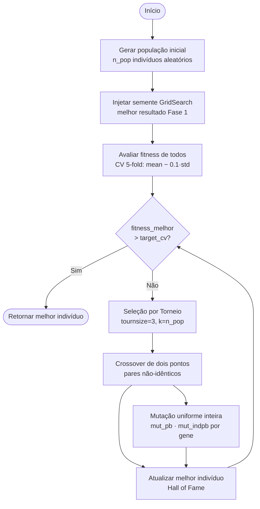
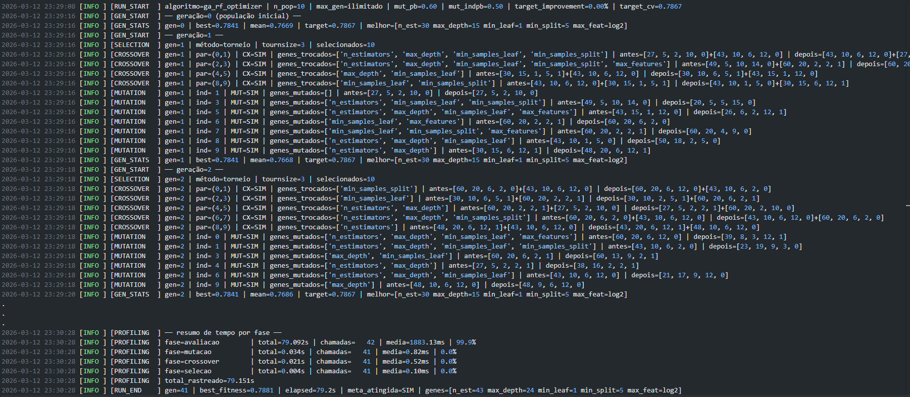
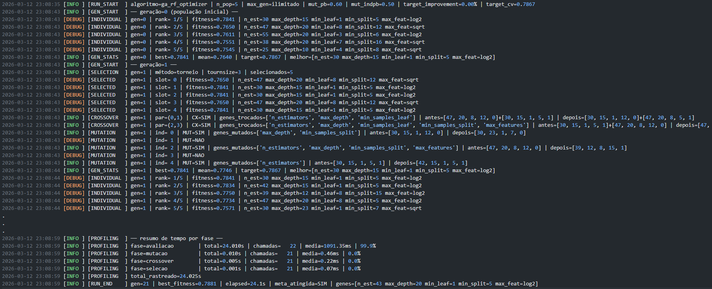

# Tech Challenge Fase 2 — Otimização com Algoritmo Genético 🧬

Projeto de Machine Learning desenvolvido como parte do **Tech Challenge - Fase 2** do curso **FIAP AI para DEVs (8IADT)**. O objetivo é aprimorar o modelo Random Forest construído na Fase 1 por meio de um **Algoritmo Genético (AG) implementado do zero**, que automatiza a busca pela combinação ideal de hiperparâmetros.

## 👥 Integrantes - Grupo 61
- Rodrigo de Araújo Rosa
- Elias Maximiano da Silva
- Danilo Pereira
- Fábia Gomes de Jesus

## 📊 Sobre o Projeto

Na Fase 1, o melhor modelo obtido foi um **Random Forest** com acurácia de **75,32%** no conjunto de teste e **CV accuracy de 78,67%** (5-fold), cujos hiperparâmetros foram encontrados via `GridSearchCV`. Na Fase 2, o desafio é superar esse resultado utilizando um **Algoritmo Genético** como estratégia de busca por hiperparâmetros.

### Objetivo
Implementar do zero um Algoritmo Genético capaz de otimizar os hiperparâmetros do `RandomForestClassifier`, superando a acurácia de validação cruzada (CV 5-fold = **0,7867**) obtida pelo GridSearch na Fase 1.

### Dataset
- **Arquivo**: `data/processed/diabetes_treated.csv`
- **Contexto**: Dados clínicos tratados na Fase 1 para detecção de diabetes (Pima Indians Dataset).
- **Variável Target**: `Outcome` (0 = Não Diabético, 1 = Diabético)
- **Divisão**: 80% treino / 20% teste, com estratificação pelo target (`random_state=42`).

## 🧬 O Algoritmo Genético

### Conceito

Um Algoritmo Genético é uma metaheurística inspirada na teoria evolutiva de Darwin. A ideia central é manter uma **população** de soluções candidatas (indivíduos), que evoluem geração a geração por meio de três operadores:

1. **Seleção** — os indivíduos mais aptos têm maior chance de se reproduzir.
2. **Crossover (Cruzamento)** — combina material genético de dois pais para gerar filhos.
3. **Mutação** — introduz variações aleatórias para manter diversidade genética.

Ao longo das gerações, a população tende a convergir para regiões de alta aptidão no espaço de busca — neste projeto, regiões com boa acurácia de validação cruzada.

### Representação do Indivíduo (Cromossomo)

Cada indivíduo é uma lista de **5 genes inteiros**, onde cada posição representa um hiperparâmetro do `RandomForestClassifier`:

| Gene | Hiperparâmetro       | Tipo       | Intervalo / Opções        | Descrição                                                         |
|:----:|:---------------------|:----------:|:--------------------------|:------------------------------------------------------------------|
| [0]  | `n_estimators`       | inteiro    | 20 – 60                   | Número de árvores na floresta                                     |
| [1]  | `max_depth`          | categórico | 5, 10, 15, 20, 25         | Profundidade máxima de cada árvore                                |
| [2]  | `min_samples_leaf`   | inteiro    | 1 – 10                    | Mínimo de amostras por folha                                      |
| [3]  | `min_samples_split`  | inteiro    | 2 – 20                    | Mínimo de amostras para dividir um nó interno                     |
| [4]  | `max_features`       | binário    | 0 = `sqrt`, 1 = `log2`    | Critério de seleção de variáveis por divisão                      |

### Função de Aptidão (Fitness)

A aptidão de cada indivíduo é calculada treinando um `RandomForestClassifier` com seus genes e aplicando **validação cruzada estratificada de 5 folds**:

$$\text{fitness} = \overline{\text{CV}} - 0{,}1 \times \sigma_{\text{CV}}$$

Combinar média e desvio padrão penaliza soluções instáveis — aquelas que acertam muito em alguns folds mas erram em outros. O objetivo é encontrar modelos acurados **e** consistentes.

### Critério de Parada

A execução encerra quando o melhor indivíduo supera a meta de acurácia:

$$\text{target\_cv} = 0{,}7867 \times (1 + \text{target\_improvement})$$

O parâmetro `target_improvement` (padrão `0.0`) permite exigir uma melhoria percentual adicional sobre a referência da Fase 1. O usuário também pode interromper manualmente a qualquer momento com `Ctrl+C`.

## ⚙️ Implementação

### Inicialização da População com Semente (Elitismo de Semente)

A população inicial é gerada aleatoriamente, mas o **primeiro indivíduo é substituído pela melhor solução conhecida do GridSearch da Fase 1** (`n_estimators=30, max_depth=15, min_samples_leaf=1, min_samples_split=5, max_features='log2'`). Essa estratégia garante que o AG parta de um ponto já competitivo, reduzindo o tempo de convergência.

### Seleção por Torneio

Para cada vaga no offspring (descendência):
1. Sorteia `tournsize=3` candidatos aleatoriamente da população.
2. O campeão do torneio (maior fitness) é selecionado.

> **Vantagem sobre a seleção por roleta**: não exige fitness positivo ou normalizado, e o parâmetro `tournsize` controla diretamente a pressão seletiva.

### Crossover de Dois Pontos com Garantia de Divergência

O crossover é realizado em pares consecutivos do offspring. Uma melhoria importante foi implementada para evitar **crossovers nulos**: antes de aplicar o operador, o algoritmo identifica as posições onde os dois pais diferem e ancora um dos pontos de corte nessa região, garantindo que o segmento trocado contenha ao menos um gene distinto.

```
Pai 1: [53, 15, 8, 5, 1]    Pai 2: [36, 13, 1, 5, 1]
Genes divergentes: posições 0, 1, 2  → ancora em pivot = 1
cx1=0, cx2=3

Filho 1: [36, 13, 1, 5, 1]   Filho 2: [53, 15, 8, 5, 1]
```

### Mutação Uniforme Inteira

Para cada indivíduo, com probabilidade `mut_pb=0.6`, a mutação é aplicada. Para cada gene `i`, com probabilidade `mut_indpb=0.5`, o gene é substituído por um inteiro sorteado uniformemente dentro dos limites `[GENE_LOW[i], GENE_HIGH[i]]`.

> Com `mut_indpb=0.5` e 5 genes, em média 2–3 genes são alterados a cada mutação.

### Avaliação Lazy (Reavaliação Seletiva)

Cada indivíduo carrega um atributo `fitness`. Quando o crossover ou a mutação modifica um indivíduo, seu fitness é **invalidado** (`fitness = None`). No passo de avaliação, apenas os indivíduos com `fitness is None` são reavaliados. Isso economiza chamadas ao modelo e reduz significativamente o tempo total de execução — especialmente importante pois o CV representa ~99,9% do tempo computacional.

### Elitismo Implícito (Best Individual Global)

O melhor indivíduo global (`best_ind`) é mantido fora da população corrente. Mesmo que gerações futuras percam diversidade, o melhor resultado já visto é sempre preservado.

### Fluxo por Geração

```
Geração N:
    1. Seleção por Torneio   → k=n_pop indivíduos escolhidos da população atual
    2. Clonagem              → offspring é uma cópia profunda dos selecionados
    3. Crossover (pares)     → combina pares consecutivos; invalida fitness dos filhos alterados
    4. Mutação               → candidato a mutação por indivíduo; invalida fitness dos mutados
    5. Avaliação Lazy        → reavalia somente indivíduos com fitness=None (CV 5-fold)
    6. Atualiza best_ind     → se o melhor da geração supera o best_ind global
    7. Verifica critério     → se best_fitness > target_cv → encerra; senão → próxima geração
```

### Diagrama

Critério de parada: `cv_acc > target_cv`, onde `target_cv = PHASE1_CV_ACCURACY × (1 + target_improvement)`.



## 📈 Pipeline da Fase 2 (EXEMPLO)

### 1. Carregamento dos Dados
O dataset pré-processado da Fase 1 (`diabetes_treated.csv`) é carregado e dividido em treino (80%) e teste (20%) com estratificação.

### 2. Execução do Algoritmo Genético
O AG otimiza os 5 hiperparâmetros do `RandomForestClassifier` usando CV 5-fold como métrica de aptidão. A cada geração, o progresso é exibido no console ou no dashboard Streamlit.

### 3. Avaliação do Melhor Indivíduo
Ao encerrar, o melhor indivíduo encontrado é decodificado e um `RandomForestClassifier` final é treinado com esses hiperparâmetros e avaliado no conjunto de teste.

### 4. Comparação com o Modelo Original
O modelo otimizado pelo AG é comparado diretamente com o modelo da Fase 1 (salvo em `models/model_diabetes_rf_original.pkl`), exibindo acurácia, delta de melhoria e relatório de classificação completo.

### 5. Exportação do Modelo
Se a meta de CV for atingida, o modelo otimizado é serializado em `models/model_diabetes_rf_optimized_{timestamp}.pkl` e o relatório comparativo é salvo em `logs/summary_ga_rf_optimizer_{timestamp}.txt`.

## 🏆 Resultados Obtidos

O AG encontrou um conjunto de hiperparâmetros superior ao GridSearch da Fase 1 após **35 gerações**:

### Melhor Indivíduo Encontrado

| Hiperparâmetro       | Valor      |
|:---------------------|:----------:|
| `n_estimators`       | 43         |
| `max_depth`          | 24         |
| `min_samples_leaf`   | 1          |
| `min_samples_split`  | 5          |
| `max_features`       | `log2`     |
| **CV accuracy**      | **0,7881** |

### Comparação com o Modelo Original (Fase 1)

| Modelo                          | Acurácia no Teste | CV Accuracy | F1 (Diabético) |
|:--------------------------------|:-----------------:|:-----------:|:--------------:|
| **Original (GridSearch Fase 1)**| 75,32%            | 78,67%      | 0,62           |
| **Otimizado (AG Fase 2)**       | **75,97%**        | **78,81%** | **0,63**       |
| **Δ (melhoria)**                | **+0,65 p.p.**   | **+0,14 p.p.** | **+0,01** |

> O AG superou a meta de CV accuracy (0,7867) e melhorou tanto a acurácia no teste quanto o F1-Score para a classe diabético, confirmando a eficácia da otimização evolutiva.

### Relatório de Classificação — Modelo Otimizado (AG)

```
               precision    recall  f1-score   support

Não diabético       0.79      0.85      0.82       100
    Diabético       0.68      0.59      0.63        54

     accuracy                           0.76       154
    macro avg       0.74      0.72      0.73       154
 weighted avg       0.75      0.76      0.76       154
```

### Profiling — Tempo por Fase (35 gerações)

| Fase        | Total (s) | Chamadas | Média (ms) | % do tempo |
|:------------|:---------:|:--------:|:----------:|:----------:|
| Avaliação   | 196,37    | 35       | 5610,50    | 99,9%      |
| Mutação     | 0,093     | 35       | 2,66       | 0,0%       |
| Crossover   | 0,058     | 35       | 1,66       | 0,0%       |
| Seleção     | 0,009     | 35       | 0,25       | 0,0%       |

> Praticamente todo o custo computacional está na avaliação (CV 5-fold). Os operadores genéticos são extremamente rápidos — a otimização lazy de reavaliação é essencial para a viabilidade do AG.

## 🖥️ Dashboard Interativo (Streamlit)

A aplicação Streamlit (`src/app.py`) oferece uma interface visual completa para acompanhar e controlar o AG em tempo real:

- **Configuração via sidebar**: tamanho da população, número máximo de gerações, melhoria-alvo e probabilidades de mutação.
- **Gráfico de evolução ao vivo**: fitness do melhor indivíduo e fitness médio da população por geração, com linha de referência da meta.
- **Visualização do cromossomo**: heatmap com os 5 genes do melhor indivíduo atual.
- **Exploração do espaço de hiperparâmetros**: scatter plots acumulados de todos os indivíduos já avaliados, coloridos por fitness.
- **Tabela da população**: todos os indivíduos da geração atual, ordenados por fitness.
- **Avaliação no conjunto de teste**: acurácia e relatório de classificação do melhor indivíduo ao final.
- **Exportação do modelo**: download do modelo treinado no formato `.pkl` com validação de integridade da serialização.
- **Imagem resumo**: figura salva automaticamente em `images/` quando a meta é atingida, contendo evolução do fitness, hiperparâmetros e comparação com o modelo original.

### Execução do Dashboard

```bash
streamlit run src/app.py
```

### Preview

| Painel de Evolução | Painel de Exploração |
|:---:|:---:|
|  |  |

## 🔄 Módulo de Log (`ga_logger.py`)

Cada execução do AG gera automaticamente um arquivo de log detalhado em `logs/{algoritmo}_{timestamp}.log`, registrando:

- Parâmetros de configuração da execução.
- **Evento de seleção**: indivíduos escolhidos por torneio a cada geração.
- **Crossovers**: pares originais, filhos gerados e se houve troca efetiva.
- **Mutações**: gene(s) alterados por indivíduo.
- **Estatísticas por geração**: melhor fitness, fitness médio, situação da meta.
- **Profiling**: tempo acumulado por fase (seleção, crossover, mutação, avaliação).
- Resumo final comparativo salvo em `logs/summary_ga_rf_optimizer_{timestamp}.txt`.

O nível de detalhe é controlável via variável de ambiente `GA_LOG_LEVEL` (valores: `INFO` ou `DEBUG`).

## 🧪 Scripts de Demonstração

A pasta `src/demo/` contém scripts independentes para visualizar o funcionamento de cada operador genético isoladamente, sem depender do dataset:

| Script                    | Descrição                                                        |
|:--------------------------|:-----------------------------------------------------------------|
| `demo_selection.py`       | Demonstra a seleção por torneio sobre uma população artificial   |
| `demo_crossover.py`       | Ilustra o crossover de dois pontos com marcadores de genes trocados |
| `demo_mutate.py`          | Exibe a mutação gene a gene com destaques de alterações          |
| `demo_ga_operators.py`    | Simula uma geração completa (seleção + crossover + mutação)      |

```bash
python src/demo/demo_selection.py
python src/demo/demo_crossover.py
python src/demo/demo_mutate.py
python src/demo/demo_ga_operators.py
```

## ✅ Testes Unitários

Os testes em `src/test/test_ga_rf_optimizer.py` cobrem:

- Criação e comportamento da classe `Individual` (inicialização, cópia)
- Geração de indivíduos aleatórios dentro dos limites do espaço de busca
- Criação da população com semente (`create_seeded_pop`)
- Operador de crossover: troca efetiva, pais idênticos, imutabilidade dos pais
- Operador de mutação: limites respeitados, probabilidade `mut_indpb`
- Operador de seleção: tamanho correto, preferência pelos mais aptos

```bash
pytest src/test/test_ga_rf_optimizer.py -v -s
```

## ℹ️ Alternativa: DEAP Framework

O módulo `src/engine/ga_deap.py` implementa o **mesmo algoritmo genético** usando o framework **DEAP** (_Distributed Evolutionary Algorithms in Python_), e pode ser utilizado como alternativa à implementação manual via argumento de linha de comando.

O DEAP abstrai grande parte da infraestrutura de um AG, oferecendo vantagens como:

- **Operadores prontos e testados**: `tools.cxTwoPoint`, `tools.mutUniformInt`, `tools.selTournament`, entre outros, evitando a necessidade de implementação manual.
- **Sistema de registro (`Toolbox`)**: centraliza geradores de indivíduos, operadores e funções de avaliação em um único objeto configurável.
- **`HallOfFame`**: rastreia automaticamente os melhores indivíduos de toda a execução sem código adicional.
- **Tipos extensíveis (`creator`)**: permite criar tipos customizados de `Fitness` e `Individual` via herança dinâmica, com suporte nativo a problemas mono e multiobjetivo.
- **Suporte a paralelismo**: integração direta com `multiprocessing` e `SCOOP` para avaliações paralelas.
- **Menor boilerplate**: o mesmo AG requer significativamente menos código, tornando o framework adequado especialmente para prototipagem rápida e problemas de otimização evolutiva mais complexos.

Documentação: [DEAP documentation](https://deap.readthedocs.io/en/master/index.html)

Para executar a versão DEAP:

```bash
python src/main.py ga_deap --n_pop 10
```

## 🗂️ Estrutura do Projeto

```
├── data/
│   ├── processed/
│   │   └── diabetes_treated.csv        # Dataset pré-processado (Fase 1)
│   └── raw/
│       └── diabetes.csv                # Dataset original
├── images/
│   └── resultado_ga_rf_optimizer_*.png # Figuras resumo geradas pelo AG
├── logs/
│   ├── ga_rf_optimizer_*.log           # Log detalhado por execução
│   └── summary_ga_rf_optimizer_*.txt   # Relatório comparativo por execução
├── models/
│   ├── model_diabetes_rf_original.pkl  # Modelo original da Fase 1
│   └── model_diabetes_rf_optimized_*.pkl # Modelos otimizados pelo AG
├── src/
│   ├── app.py                          # Dashboard Streamlit (visualização ao vivo)
│   ├── main.py                         # CLI: python main.py ga_rf_optimizer [opções]
│   ├── demo/
│   │   ├── demo_crossover.py           # Demo do operador de crossover
│   │   ├── demo_ga_operators.py        # Demo de uma geração completa do AG
│   │   ├── demo_mutate.py              # Demo do operador de mutação
│   │   └── demo_selection.py           # Demo da seleção por torneio
│   ├── engine/
│   │   ├── __init__.py
│   │   ├── ga_rf_optimizer.py          # Implementação manual do AG (principal)
│   │   ├── ga_deap.py                  # Implementação alternativa com DEAP
│   │   └── ga_logger.py                # Módulo de logging e profiling
│   └── test/
│       └── test_ga_rf_optimizer.py     # Testes unitários do AG
├── README.md                           # Documentação do projeto
├── requirements.txt                    # Dependências do projeto
└── LICENSE
```

## 🚀 Como Executar

### Pré-requisitos
- Python 3.10 ou superior
- pip (gerenciador de pacotes Python)

### Passo a Passo

1. **Clone o repositório** e acesse a pasta do projeto.

2. **Crie e ative um ambiente virtual**
```bash
# Windows
python -m venv .venv
.venv\Scripts\activate

# Linux/Mac
python3 -m venv .venv
source .venv/bin/activate
```

3. **Se necessário, atualize o pip (opcional)**
```bash
python -m pip install --upgrade pip
```

4. **Instale as dependências**
```bash
pip install -r requirements.txt
```

5. **Se estiver usando VSCode** *(selecione o interpretador Python)*
```bash
Pressione Ctrl+Shift+P
Digite "Python: Select Interpreter"
Selecione o .venv do projeto (ex: python.exe)
```

6. **Execute o Dashboard Streamlit** *(modo recomendado)*
```bash
streamlit run src/app.py
```

7. **Ou execute via CLI** para rodar o AG no terminal:
```bash
# Execução padrão (população 10, meta: superar CV 0.7867)
python src/main.py ga_rf_optimizer

# Com parâmetros customizados
python src/main.py ga_rf_optimizer --n_pop 20 --target_improvement 0.01 --mut_pb 0.5 --mut_indpb 0.4
```

### Parâmetros da CLI

| Parâmetro             | Padrão | Descrição                                                                      |
|:----------------------|:------:|:-------------------------------------------------------------------------------|
| `algorithm`           | —      | Implementação a usar: `ga_rf_optimizer` ou `ga_deap`                           |
| `--n_pop`             | 10     | Tamanho da população                                                           |
| `--target_improvement`| 0.0    | Melhoria percentual desejada sobre a meta base (ex: `0.01` = +1% acima de 0.7867) |
| `--mut_pb`            | 0.6    | Probabilidade de um indivíduo sofrer mutação                                   |
| `--mut_indpb`         | 0.5    | Probabilidade de mutar cada gene individualmente                               |

## 🛠️ Tecnologias Utilizadas

- **Python 3.10+**
- **Scikit-learn** — `RandomForestClassifier`, `cross_val_score`, `train_test_split`
- **Pandas / NumPy** — Manipulação de dados
- **Streamlit** — Dashboard interativo com atualização em tempo real
- **Altair** — Gráficos declarativos para visualização da evolução e exploração do espaço
- **Matplotlib** — Geração de figuras resumo salvas em `images/`
- **DEAP** — Framework evolucional (utilizado na implementação alternativa)
- **Python-dotenv** — Configuração do nível de log via variável de ambiente
- **pytest** — Testes unitários

## ⚡ Configuração de Log

O nível de detalhamento do log pode ser controlado criando um arquivo `.env` na raiz do projeto:

```dotenv
# .env
GA_LOG_LEVEL=DEBUG   # INFO (padrão) ou DEBUG (logs mais detalhados)
```

### Seções do Log

Cada linha do log é prefixada com uma tag de seção entre colchetes. A tabela abaixo descreve o conteúdo de cada uma:

| Seção          | Nível   | Descrição                                                                                                          |
|:---------------|:-------:|:-------------------------------------------------------------------------------------------------------------------|
| `[RUN_START]`  | INFO    | Registra os parâmetros da execução: algoritmo, tamanho da população, `max_gen`, probabilidades de mutação e meta de CV. |
| `[GEN_START]`  | INFO    | Marca o início de cada geração (ex.: `── geração=1 ──`). A geração 0 corresponde à população inicial.             |
| `[GEN_STATS]`  | INFO    | Estatísticas ao fim de cada geração: melhor fitness, fitness médio, meta de CV e genes do melhor indivíduo.        |
| `[SELECTION]`  | INFO    | Resume a seleção por torneio: método, `tournsize` e quantidade de indivíduos selecionados.                         |
| `[CROSSOVER]`  | INFO    | Para pares que realizaram troca (`CX=SIM`): registra os índices do par, os genes trocados e os cromossomos antes/depois. Pares com pais idênticos (`CX=NAO`) são omitidos no nível INFO. |
| `[MUTATION]`   | INFO    | Para indivíduos mutados (`MUT=SIM`): registra o índice do indivíduo, os genes alterados e o cromossomo antes/depois. Indivíduos não mutados (`MUT=NAO`) são omitidos no nível INFO. |
| `[RUN_END]`    | INFO    | Registra o encerramento da execução: geração final, melhor fitness, tempo total, se a meta foi atingida e os genes do melhor indivíduo. |
| `[PROFILING]`  | INFO    | Bloco emitido ao final com o tempo acumulado por fase (seleção, crossover, mutação, avaliação): total, chamadas, média e percentual. |

| Log INFO - Estrutura |
|:---:|
|  |

Com `GA_LOG_LEVEL=DEBUG`, duas seções adicionais são emitidas:

| Seção          | Nível   | Descrição                                                                                                          |
|:---------------|:-------:|:-------------------------------------------------------------------------------------------------------------------|
| `[INDIVIDUAL]` | DEBUG   | Lista todos os indivíduos da população ao fim de cada geração, ordenados por fitness (rank), com seus genes decodificados. |
| `[SELECTED]`   | DEBUG   | Lista cada indivíduo escolhido pela seleção por torneio, com seu slot na nova geração, fitness e genes.            |

> Com `DEBUG` também passam a aparecer as entradas `[CROSSOVER] CX=NAO` e `[MUTATION] MUT=NAO`, registrando os pares e indivíduos que **não** foram modificados em cada geração.

| Log DEBUG - Estrutura |
|:---:|
|  |

## ⚠️ Dicas e Solução de Problemas

### CSV não encontrado
- Confirme que o arquivo está em `data/processed/diabetes_treated.csv`
- O arquivo é gerado pelo pré-processamento da Fase 1; baixando o repositório completo ele já está incluído

### Modelo original não encontrado para comparação
- O arquivo `models/model_diabetes_rf_original.pkl` deve estar presente para a comparação funcionar
- Sem ele, o CLI exibe apenas os resultados do modelo otimizado, sem delta de melhoria

### Execução muito lenta
- A avaliação via CV 5-fold representa ~99,9% do tempo computacional
- Reduza `--n_pop` para populações menores (ex: `--n_pop 5`) para execuções mais rápidas em hardware limitado
- O AG usa `n_jobs=-1` no RandomForest, aproveitando todos os núcleos disponíveis

### Streamlit não atualiza em tempo real
- Certifique-se de que o ambiente virtual está ativado antes de executar `streamlit run src/app.py`
- Em caso de erro de importação, verifique se o terminal está na raiz do projeto

## 🔄 Reprodutibilidade

Todos os processos aleatórios usam `random_state=42` onde aplicável:
- Divisão treino/teste do dataset
- Inicialização do `RandomForestClassifier` para avaliação do CV
- O AG em si usa o módulo `random` do Python (sem seed global fixa), pois a natureza estocástica é intencional — execuções distintas exploram regiões diferentes do espaço de busca

## 📄 Licença


Uso educacional. Ajuste conforme necessário para seu contexto.

---

**Desenvolvido como parte do Tech Chalenge FIAP - AI para DEVs (Fase 2) - Turma 8IADT - 2025/2026**
