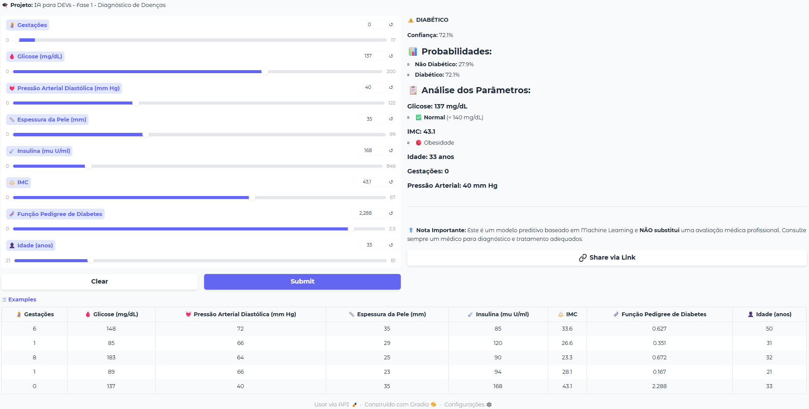

# Tech Challenge - Diagnóstico de Doenças 🏥

Projeto de Machine Learning desenvolvido como parte do **Tech Challenge - Fase 1** do curso **FIAP AI para DEVs (8IADT)**. O objetivo é criar um sistema inteligente de suporte ao diagnóstico para um hospital universitário, focado inicialmente na predição de diabetes.

## 👥 Integrantes - Grupo 40
- Rodrigo de Araújo Rosa
- Elias Maximiano da Silva
- Danilo Pereira
- Fábia Gomes de Jesus

## 📊 Sobre o Projeto

Um grande hospital universitário busca implementar um sistema inteligente de suporte ao diagnóstico para auxiliar médicos e equipes clínicas. Nesta primeira fase, o desafio foi construir um modelo de Machine Learning capaz de analisar dados clínicos para prever a probabilidade de um paciente possuir diabetes.

### Objetivo
Construir uma solução inicial de IA para processamento de dados médicos, aplicando fundamentos de Machine Learning para análise automática de exames e triagem de pacientes.

### Dataset
- **Arquivo**: `data/raw/diabetes.csv`
- **Contexto**: Dados clínicos de pacientes para detecção de diabetes.
- **Variável Target**: `Outcome` (0 = Não Diabético, 1 = Diabético)

## 📈 Pipeline de Machine Learning

### 1. Análise Exploratória de Dados (EDA)
- ✅ **Verificação de Consistência**: Identificação de dados nulos e valores zerados em colunas críticas (`Glucose`, `BloodPressure`, `SkinThickness`, `Insulin`, `BMI`).
- ✅ **Análise de Outliers**: Utilização de Boxplots e Violinplots para detectar anomalias.
- ✅ **Análise de Distribuição**: Histogramas e Pairplots para entender o comportamento das variáveis variáveis.
- ✅ **Correlação**: Matriz de correlação (Heatmap) para identificar variáveis preditoras fortes (ex: `Glucose`, `BMI`, `Age`).

### 2. Pré-processamento e Otimização
- **Tratamento de Dados Faltantes**: Valores zerados (missing values) identificados em colunas críticas como glicose e insulina foram tratados.
- **Divisão do Dataset**: 80% para treino e 20% para teste, com estratificação baseada no target.
- **Escalonamento**: Aplicação de `StandardScaler` para normalizar dados em modelos sensíveis à escala (KNN, Regressão Logística).
- **Balanceamento de Classes**: Aplicação da técnica **SMOTE** (Synthetic Minority Over-sampling Technique) nos dados de treino. O objetivo foi mitigar o desbalanceamento do target e aumentar a capacidade do modelo em detectar casos positivos (Recall), reduzindo Falsos Negativos.

### 3. Modelos Treinados
- **Regressão Logística**: Modelo linear base. Avaliação de parâmetros de regularização (C).
- **KNN (K-Nearest Neighbors)**: Otimização do número de vizinhos (K=19 escolhido após análise de taxa de erro). Modelo estável.
- **Árvore de Decisão**: Sofreu com overfitting severo. A poda (`max_depth=2`) foi necessária, resultando em um modelo simplista.
- **Random Forest (Floresta Aleatória)**: Otimização robusta via `GridSearchCV` (best params: `max_depth=15`, `max_features='log2'`, etc.). Demonstrou o melhor desempenho geral, lidando bem com a complexidade dos dados.

### 4. Validação e Explicabilidade
- ✅ **Métricas**: Matriz de Confusão, Acurácia, Precision, Recall e F1-Score.
- ✅ **Curvas ROC**: Comparação da área sob a curva (AUC) para medir capacidade de discriminação.
- ✅ **SHAP Values**: Análise com `shap.force_plot` e `shap.summary_plot` para explicar a importância das features em cada modelo.
- ✅ **Visualização de Árvore**: Uso de `dtreeviz` para interpretar as regras de decisão.

## 🏆 Resultados Obtidos e Conclusão

Diversos modelos de classificação foram treinados e avaliados. O **Random Forest (Floresta Aleatória)** destacou-se como a melhor solução para o problema.

| Modelo | Acurácia | AUC | F1-Score (Diabetes) | Status |
|:---|:---:|:---:|:---:|:---|
| **Random Forest (sem SMOTE)** | **75.32%** | **0.81** | **0.62** | **Vencedor: Melhor equilíbrio geral.** |
| **Random Forest (com SMOTE)** | 72.73% | 0.79 | 0.63 | Aumento de Recall, mas perde Precisão. |
| **KNN** | 72.73% | 0.79 | 0.60 | Bom desempenho, segunda melhor opção. |
| **Reg. Logística** | 70.78% | 0.81 | 0.59 | Conservador. Alta especificidade. |
| **Árvore Decisão** | 68.83% | 0.69 | 0.46 | Instável e desempenho inferior. |

### Experimentação com SMOTE
Foi realizada uma etapa de otimização aplicando **SMOTE** para balancear as classes no treino.
- **Resultado**: O modelo "com SMOTE" obteve um aumento no **Recall** (de ~57% para ~67%) para a classe **Diabetes**.
- **Impacto Clínico**: Embora a acurácia geral tenha caído ligeiramente (de 75% para 73%), o modelo tornou-se mais sensível para detectar doentes (menos Falsos Negativos), o que é crítico em diagnósticos médicos. No entanto, o aumento de Falsos Positivos também foi observado.
- **Decisão Final**: O modelo **Random Forest** (validado com e sem SMOTE) mostrou-se a arquitetura mais confiável. A versão final pode priorizar o Recall (com SMOTE) ou a Precisão (sem SMOTE) dependendo da estratégia clínica (triagem agressiva vs diagnósticos precisos). Nossa análise recomenda o uso do Random Forest como base sólida para o sistema.

## 🎯 Demonstração Online

O modelo treinado está disponível em uma aplicação interativa no **Hugging Face Spaces**! Você pode testar o sistema de detecção de diabetes sem precisar configurar o ambiente local.

**🔗 Acesse aqui**: [Detector de Diabetes - Tech Challenge 8IADT](https://huggingface.co/spaces/rodrigoaraujorosa/detector-diabetes-techchalenge-8iadt)

A aplicação permite:
- Inserir dados clínicos de pacientes
- Obter predições em tempo real usando o modelo Random Forest treinado
- Experimentar diferentes cenários e visualizar os resultados

### 📸 Preview da Aplicação



*Interface interativa do detector de diabetes mostrando os parâmetros clínicos e resultado da predição em tempo real.*

## 🗂️ Estrutura do Projeto

```
├── data/
│   ├── raw/                    # Dados brutos (diabetes.csv)
├── images/
│   └── app-demo.png            # Preview da aplicação
├── notebooks/
│   └── FIAP_AI_para_DEVs_8IADT_Fase_1_Tech_Chalenge.ipynb  # Notebook principal com ├── README.md                   # Documentação do projeto
├── requirements.txt            # Dependências do projeto
└── requirements-dev.txt        # Dependências de desenvolvimento
```

## 🚀 Como Executar

### Pré-requisitos
- Python 3.10 ou superior
- pip (gerenciador de pacotes Python)
- Graphviz (para visualização de árvores de decisão). Baixe e instale o Graphviz através do [site oficial](https://graphviz.org/download/).
- VS Code com extensão Jupyter (recomendado)

### Passo a Passo

1. **Clone o repositório** e acesse a pasta do projeto.

2. **Crie e ative um ambiente virtual**
```bash
# Windows
python -m venv .venv
.venv\Scripts\activate

# Linux/Mac
python3 -m venv .venv
source .venv/bin/activate
```

3. **Instale as dependências**
```bash
pip install -r requirements.txt
```

4. **Execute o Notebook**
- Abra o arquivo `notebooks/FIAP_AI_para_DEVs_8IADT_Fase_1_Tech_Chalenge.ipynb` no VS Code.
- Selecione o kernel do seu ambiente virtual (`.venv`).
- Execute as células para visualizar a análise exploratória, o treinamento dos modelos e os resultados.

## 🛠️ Tecnologias Utilizadas
- Python
- Pandas / NumPy (Manipulação de dados)
- Matplotlib / Seaborn (Visualização)
- Scikit-learn (Machine Learning)
- SHAP (Explicabilidade do modelo)

## ⚠️ Dicas e Solução de Problemas

### Erro ao carregar o CSV
- Confirme que o arquivo está em `data/raw/diabetes.csv`
- No notebook, o caminho relativo é `diabetes.csv` pois o notebook está em `notebooks/`

### Kernel errado
- Selecione o kernel Python do ambiente virtual `.venv` no canto superior direito do notebook

### Avisos (Warnings)
- O notebook já inclui `warnings.filterwarnings("ignore")` para silenciar avisos não críticos

## 🔄 Reprodutibilidade

Todos os processos aleatórios usam `random_state=42` para garantir resultados reprodutíveis:
- Divisão treino/teste
- Inicialização de modelos
- Seed do NumPy

## 📄 Licença


Uso educacional. Ajuste conforme necessário para seu contexto.

---

**Desenvolvido como parte do Tech Chalenge FIAP - AI para DEVs (Fase 1) - Turma 8IADT - 2025/2026**