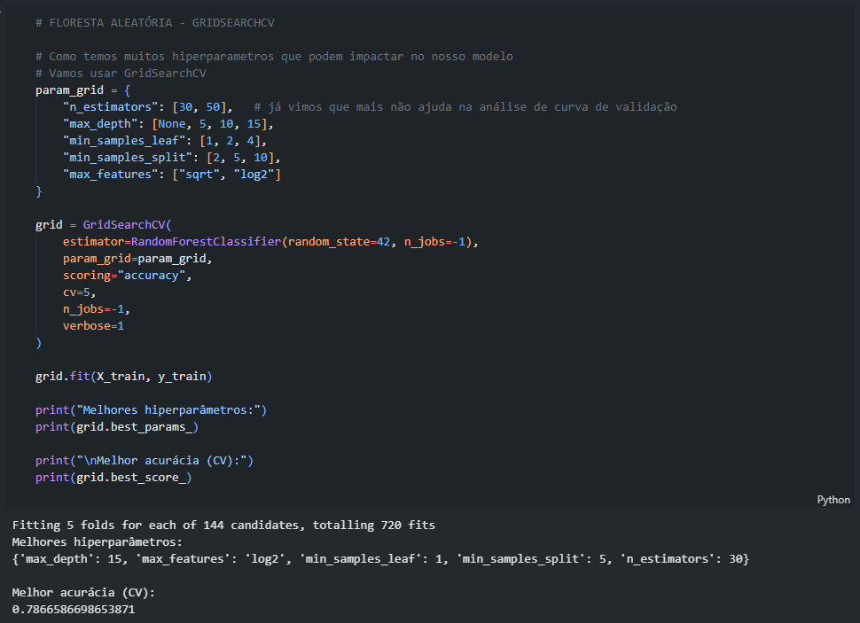
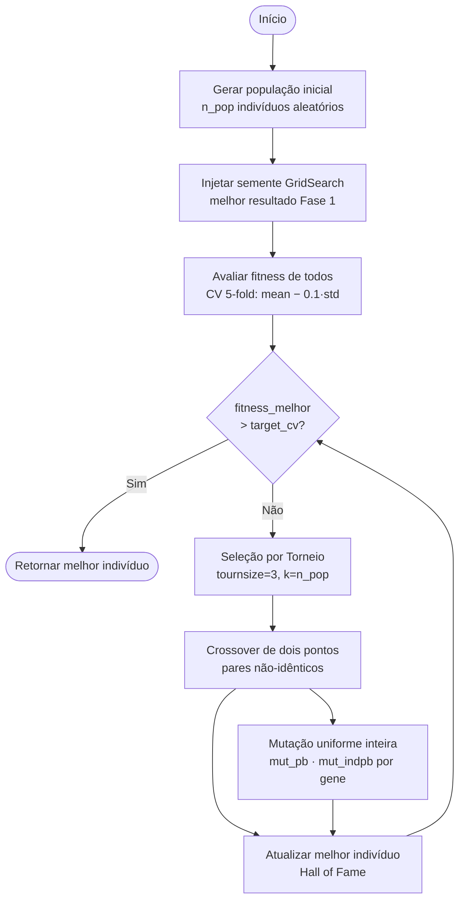
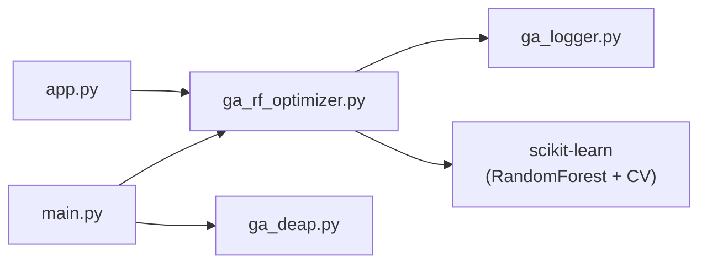
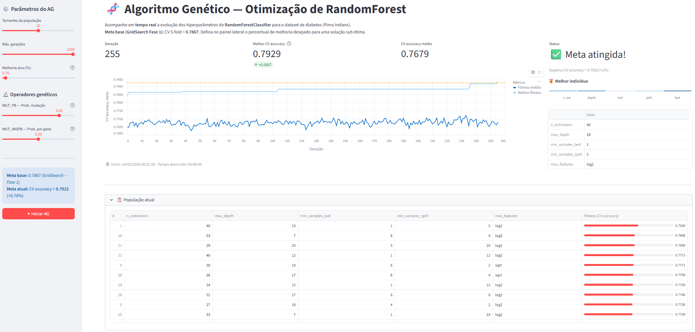
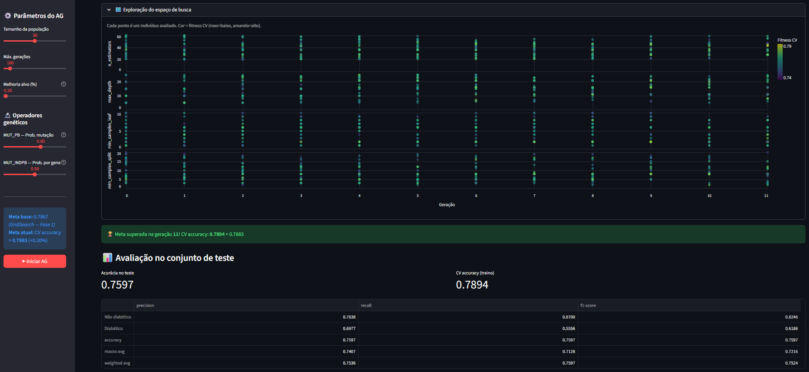
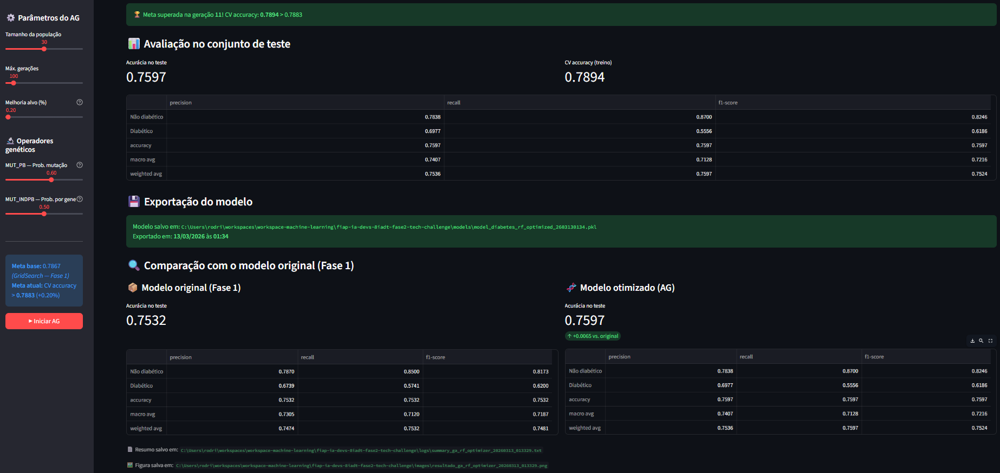
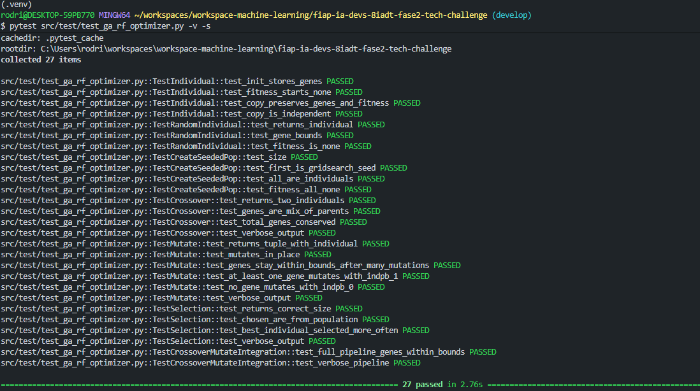
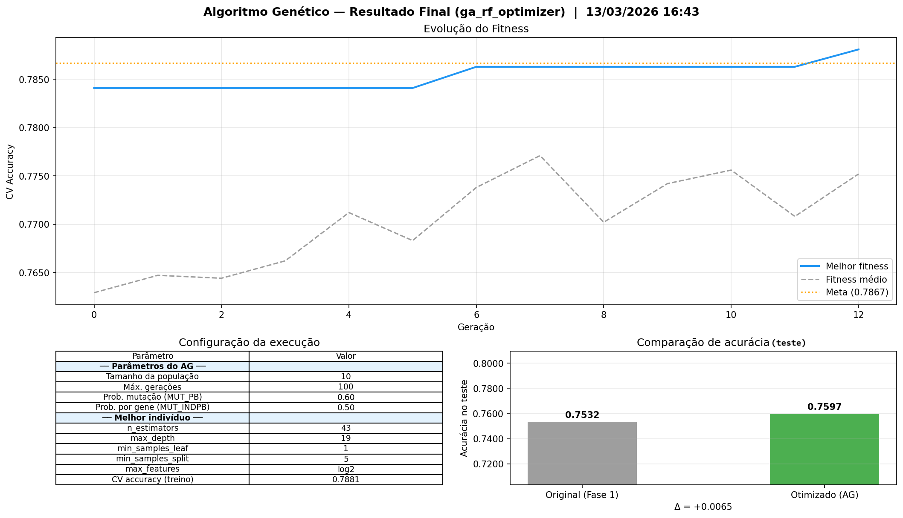
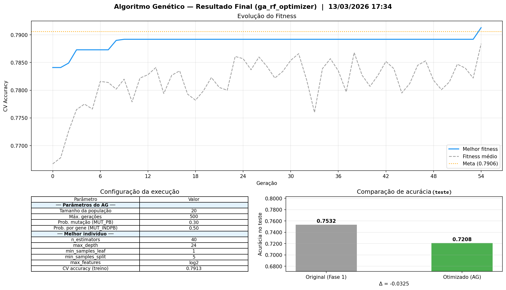
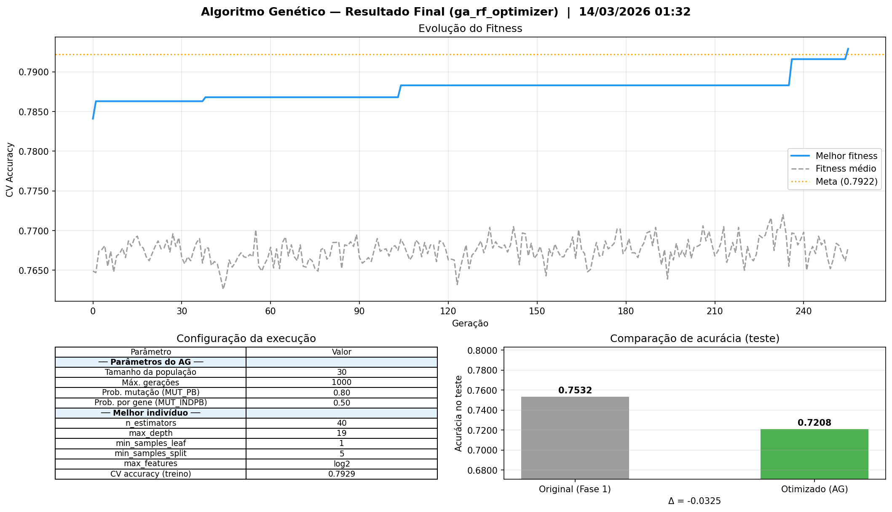

# Relatório Técnico — Tech Challenge Fase 2
## Otimização de Hiperparâmetros com Algoritmo Genético

**Curso:** FIAP AI para DEVs (8IADT)  
**Grupo:** 61  
**Integrantes:**
- Rodrigo de Araújo Rosa
- Elias Maximiano da Silva
- Danilo Pereira
- Fábia Gomes de Jesus

**Data:** Março de 2026

---

## 1. Introdução

Este relatório documenta o desenvolvimento do Tech Challenge — Fase 2, cujo objetivo é aprimorar o modelo `RandomForestClassifier` construído na Fase 1 por meio de um **Algoritmo Genético (AG) implementado do zero**, que automatiza a busca pela combinação ideal de hiperparâmetros.

Na Fase 1, o melhor modelo obtido foi um Random Forest com **acurácia de 75,32%** no conjunto de teste e **CV accuracy de 78,67%** (validação cruzada 5-fold), cujos hiperparâmetros foram encontrados via `GridSearchCV`. Na Fase 2, o desafio é superar esse resultado utilizando um Algoritmo Genético como estratégia de busca.

### 1.1 Objetivo

Implementar do zero um Algoritmo Genético capaz de otimizar os hiperparâmetros do `RandomForestClassifier`, superando a acurácia de validação cruzada (CV 5-fold = **0,7867**) obtida pelo GridSearch na Fase 1 (Figura 1).



*Figura 1 - Configuração do GridSearch na Fase 1*

### 1.2 Entregáveis do Projeto

| Entregável | Link |
|:---|:---|
| Este Relatório | Relatório Técnico do Projeto |
| Repositório — Algoritmo Genético | [github.com/rodrigoaraujorosa/fiap-ia-devs-8iadt-fase2-tech-challenge](https://github.com/rodrigoaraujorosa/fiap-ia-devs-8iadt-fase2-tech-challenge)</br>**IMPORTANTE**: o arquivo README.md do repositório tem informações de como executar o projeto e por esse motivo não será incluído neste relatório técnico|
| Repositório — Sistema de Diagnóstico de Diabetes | [github.com/rodrigoaraujorosa/detector-diabetes-optmized-techchallenge-8iadt](https://github.com/rodrigoaraujorosa/detector-diabetes-optmized-techchallenge-8iadt) |
| Hugging Face Space — Sistema de Diagnóstico | [huggingface.co/spaces/rodrigoaraujorosa/detector-diabetes-techchalenge-8iadt](https://huggingface.co/spaces/rodrigoaraujorosa/detector-diabetes-techchalenge-8iadt) |
| Vídeo de Apresentação | *Em breve* |

### 1.3 Dataset

| Item | Descrição |
|:---|:---|
| Arquivo | `data/processed/diabetes_treated.csv` |
| Contexto | Dados clínicos para detecção de diabetes (Pima Indians Dataset) |
| Variável target | `Outcome` (0 = Não Diabético, 1 = Diabético) |
| Divisão | 80% treino / 20% teste, estratificado (`random_state=42`) |
| Amostras treino | 614 |
| Amostras teste | 154 |

---

## 2. Metodologia

### 2.1 Visão Geral do Algoritmo Genético

Um Algoritmo Genético é uma metaheurística inspirada na teoria evolutiva de Darwin. A ideia central é manter uma **população** de soluções candidatas (indivíduos) que evoluem geração a geração por meio de três operadores:

1. **Seleção** — os indivíduos mais aptos têm maior chance de se reproduzir.
2. **Crossover (Cruzamento)** — combina material genético de dois pais para gerar filhos.
3. **Mutação** — introduz variações aleatórias para manter diversidade genética.

Ao longo das gerações, a população tende a convergir para regiões de alta aptidão no espaço de busca — neste projeto, regiões com boa acurácia de validação cruzada.

### 2.2 Representação do Cromossomo

Cada indivíduo é uma lista de 5 genes inteiros, onde cada posição representa um hiperparâmetro do `RandomForestClassifier`:

$$[HP_0, HP_1, HP_2, HP_3, HP_4]$$

Onde HP = Hiperparâmetro.

| Gene | Hiperparâmetro | Tipo | Intervalo / Opções | Descrição |
|:---:|:---|:---:|:---|:---|
| [0] | `n_estimators` | inteiro | 20 – 60 | Número de árvores na floresta |
| [1] | `max_depth` | categórico | 5, 10, 15, 20, 25 | Profundidade máxima de cada árvore |
| [2] | `min_samples_leaf` | inteiro | 1 – 10 | Mínimo de amostras por folha |
| [3] | `min_samples_split` | inteiro | 2 – 20 | Mínimo de amostras para dividir um nó |
| [4] | `max_features` | binário | 0 = `sqrt`, 1 = `log2` | Critério de seleção de variáveis |

### 2.3 Função de Aptidão (Fitness)

A aptidão de cada indivíduo é calculada treinando um `RandomForestClassifier` com seus genes e aplicando validação cruzada estratificada de 5 folds:

$$\text{fitness} = \overline{\text{CV}} - 0{,}1 \times \sigma_{\text{CV}}$$

Combinar média e desvio padrão penaliza soluções instáveis — aquelas que acertam muito em alguns folds mas erram em outros. O objetivo é encontrar modelos acurados e consistentes.

**Implementação**

``` python
CV_STD_PENALTY = 0.1
def evaluate(individual: Individual, X, y) -> float:
    # Decodifica gene 4: 0 → 'sqrt', 1 → 'log2'
    feat = "sqrt" if individual[4] == 0 else "log2"
    clf = RandomForestClassifier(
        n_estimators=individual[0],
        max_depth=individual[1],
        min_samples_leaf=individual[2],
        min_samples_split=individual[3],
        max_features=feat,
        random_state=42,
        n_jobs=-1,           # usa todos os núcleos disponíveis
    )
    scores = cross_val_score(clf, X, y, cv=5, scoring="accuracy", n_jobs=-1)
    # Penaliza a variância: premia acurácia alta e consistente entre folds
    return scores.mean() - CV_STD_PENALTY * scores.std()
```

### 2.4 Operadores Genéticos

**Seleção por Torneio:** Para cada vaga no offspring, sorteia-se `tournsize=3` candidatos da população e escolhe-se o de maior fitness. Não exige fitness normalizado e o parâmetro `tournsize` controla diretamente a pressão seletiva.

**Implementação**

``` python
def selection(population: list[Individual], k: int, tournsize: int = 3) -> list[Individual]:
    chosen = []
    for _ in range(k):
        # Candidatos sorteados sem reposição para evitar torneios triviais
        aspirants = random.sample(population, tournsize)
        chosen.append(max(aspirants, key=lambda ind: ind.fitness))  # type: ignore[arg-type]
    return chosen
```

**Representação**

```
Entrada (população com fitness):
I0: [43, 19, 1, 5, 1]  f=0.7881
I1: [30, 15, 1, 5, 1]  f=0.7867
I2: [40, 24, 1, 5, 1]  f=0.7913
I3: [55, 10, 3, 8, 0]  f=0.7742

Parâmetro:
tournsize=3

Processo (1 vaga no offspring):
Amostrados: I1, I3, I2
Vencedor : I2 (maior fitness)

Saída:
Offspring[0] = [40, 24, 1, 5, 1]
```

**Crossover de Dois Pontos com Garantia de Divergência:** Antes de sortear os pontos de corte, o algoritmo identifica os índices onde os dois pais diferem e ancora um dos pontos nessa região, garantindo que o segmento trocado contenha ao menos um gene distinto — eliminando crossovers nulos.

**Implementação**

``` python
def crossover(ind1: Individual, ind2: Individual) -> tuple[Individual, Individual]:
    size = len(ind1)
    # Posições onde os genes diferem — o corte deve passar por pelo menos uma
    diff = [i for i in range(size) if ind1[i] != ind2[i]]
    if not diff:
        return ind1, ind2  # pais idênticos: nada a trocar
    # Ancora em um gene divergente; expande o slice aleatoriamente ao redor dele
    pivot = random.choice(diff)
    cx1 = random.randint(0, pivot)
    cx2 = random.randint(pivot + 1, size)
    ind1[cx1:cx2], ind2[cx1:cx2] = ind2[cx1:cx2][:], ind1[cx1:cx2][:]
    return ind1, ind2
```

**Representação**

```
Entrada:
Pai 1: [53, 15, 8, 5, 1]
Pai 2: [36, 13, 1, 5, 1]

Parâmetros de corte:
Genes divergentes: posições 0, 1, 2
pivot=1, cx1=0, cx2=3

Processo:
Troca do segmento [cx1:cx2] entre os pais

Saída:
Filho 1: [36, 13, 1, 5, 1]
Filho 2: [53, 15, 8, 5, 1]
```

**Mutação Uniforme Inteira:** Para cada indivíduo, com probabilidade `mut_pb`, a mutação é aplicada. Para cada gene `i`, com probabilidade `mut_indpb`, o gene é substituído por um inteiro sorteado uniformemente dentro dos limites do espaço de busca.

**Implementação**

``` python
N_ESTIMATORS_LOW,  N_ESTIMATORS_HIGH  = 20, 60          # quantidade de árvores na floresta
MAX_DEPTH_OPTIONS = [5, 10, 15, 20, 25]                 # valores possíveis para profundidade máxima
MIN_SAMPLES_LEAF_LOW, MIN_SAMPLES_LEAF_HIGH = 1, 10     # min de amostras em cada folha
MIN_SAMPLES_SPLIT_LOW, MIN_SAMPLES_SPLIT_HIGH = 2, 20   # min de amostras para dividir um nó interno

# Vetores de limites usados pela mutação uniforme: GENE_LOW[i] e GENE_HIGH[i]
# correspondem ao gene i do indivíduo. max_features (gene 4) é binário: 0='sqrt', 1='log2'.
GENE_LOW  = [N_ESTIMATORS_LOW,  min(MAX_DEPTH_OPTIONS), MIN_SAMPLES_LEAF_LOW,  MIN_SAMPLES_SPLIT_LOW,  0]
GENE_HIGH = [N_ESTIMATORS_HIGH, max(MAX_DEPTH_OPTIONS), MIN_SAMPLES_LEAF_HIGH, MIN_SAMPLES_SPLIT_HIGH, 1]

def mutate(individual: Individual, mut_indpb: float = MUT_INDPB) -> tuple[Individual]:
    for i in range(len(individual)):
        if random.random() < mut_indpb:
            # Novo valor respeitando os limites do espaço de busca do gene i
            individual[i] = random.randint(GENE_LOW[i], GENE_HIGH[i])
    return (individual,)
```

**Representação**

```
Entrada:
Indivíduo: [43, 19, 1, 5, 1]

Parâmetro:
mut_indpb=0.50

Processo (sorteio por gene):
g0 (n_estimators)      -> SIM  -> 43 -> 39
g1 (max_depth)         -> NAO  -> 19 (mantém)
g2 (min_samples_leaf)  -> SIM  -> 1  -> 4
g3 (min_samples_split) -> NAO  -> 5  (mantém)
g4 (max_features)      -> NAO  -> 1  (mantém)

Saída:
Indivíduo mutado: [39, 19, 4, 5, 1]
```

### 2.5 Critério de Parada

```
target_cv = 0.7867 × (1 + target_improvement)
```

A execução encerra quando o melhor indivíduo supera `target_cv`. Com `target_improvement=0.0` (padrão), a meta é simplesmente superar 0,7867. 

O parâmetro `target_improvement` (padrão `0.0`) permite exigir uma melhoria percentual adicional sobre a referência da Fase 1. Se o dashboard do Streamlit estiver sendo utilizado, o usuário também pode definir o número máximo de gerações, se a evolução chegar até a geração máxima definada, sem que a meta tenha sido batida, a execução se encerra. No caso da execução estar sendo realizada via linha de comando (CLI), o usuário também pode interromper manualmente a qualquer momento com `Ctrl+C` quando executado por linha de comando.

### 2.6 Fluxo por Geração

```
Geração N:
    1. Seleção por Torneio   → k=n_pop indivíduos escolhidos da população atual
    2. Clonagem              → offspring é uma cópia profunda dos selecionados
    3. Crossover (pares)     → combina pares consecutivos; invalida fitness alterados
    4. Mutação               → candidato a mutação por indivíduo; invalida fitness mutados
    5. Avaliação Lazy        → reavalia somente indivíduos com fitness=None (CV 5-fold)
    6. Atualiza best_ind     → se o melhor da geração supera o best_ind global
    7. Verifica critério     → se best_fitness > target_cv → encerra
```



*Figura 2 - Fluxo do Algoritmo Genético*

---

## 3. Arquitetura e Decisões de Implementação

Esta seção documenta os principais desafios enfrentados durante o desenvolvimento e as soluções implementadas para resolvê-los.

### 3.1 Visão Geral dos Módulos

```
src/
├── main.py                  ← CLI: ponto de entrada via linha de comando
├── app.py                   ← Dashboard Streamlit (interface visual)
└── engine/
    ├── ga_rf_optimizer.py   ← AG implementado do zero (implementação principal)
    ├── ga_deap.py           ← AG alternativo usando o framework DEAP
    └── ga_logger.py         ← Logging, profiling e geração de relatórios
```



*Figura 3 - Arquitetura do Projeto*

### 3.2 Decisões de Projeto

**Decisão 1 — `Individual` herda de `list`**

*Desafio:* Os operadores genéticos precisam indexar e fatiar genes diretamente.  
*Solução:* A classe `Individual` estende a lista nativa do Python. Herdar de `list` evita camadas de indireção (`ind.genes[i]`) sem perda semântica — o indivíduo é o seu cromossomo.

---

**Decisão 2 — Elitismo de Semente na Inicialização**

*Desafio:* Populações iniciais puramente aleatórias podem demorar para convergir.  
*Solução:* O primeiro indivíduo é substituído pelo melhor resultado do GridSearch da Fase 1: `[30, 15, 1, 5, 1]` (CV = 78,67%). Os demais continuam aleatórios para preservar diversidade genética.

---

**Decisão 3 — Seleção por Torneio em vez de Roleta**

*Desafio:* A seleção por roleta exige fitness positivo e normalizado.  
*Solução:* Torneio com `tournsize=3` não impõe essas restrições e o parâmetro controla diretamente a pressão seletiva.

---

**Decisão 4 — Crossover com Garantia de Divergência**

*Desafio:* O crossover clássico pode gerar filhos idênticos aos pais se os pontos de corte caírem em regiões onde os genes já são iguais (crossovers nulos).  
*Solução:* Identificar os índices divergentes e ancorar um ponto de corte nessa região, garantindo troca efetiva de pelo menos um gene.

---

**Decisão 5 — Penalidade de Instabilidade no Fitness**

*Desafio:* Um modelo com alta variância entre folds pode ter boa média mas ser pouco confiável em produção.  
*Solução:* $\text{fitness} = \overline{\text{CV}} - 0{,}1 \times \sigma_{\text{CV}}$. O coeficiente `0,1` é uma penalidade leve que desfavorece instabilidade sem descartar modelos com boa acurácia média.

---

**Decisão 6 — Avaliação Lazy (Reavaliação Seletiva)**

*Desafio:* O CV 5-fold representa ~99,9% do custo computacional. Reavaliar todos os indivíduos a cada geração seria proibitivo.  
*Solução:* O fitness é invalidado (`fitness = None`) apenas quando o indivíduo é modificado por crossover ou mutação. No passo de avaliação, somente esses são reavaliados.

---

**Decisão 7 — Elitismo Implícito via `best_ind` Global**

*Desafio:* Gerações com muita mutação podem degradar toda a população, perdendo o melhor resultado já encontrado.  
*Solução:* O melhor indivíduo global é mantido em variável externa à população corrente e atualizado via cópia profunda a cada geração.

---

**Decisão 8 — `random_state=42` no `RandomForestClassifier`, não no AG**

*Desafio:* Garantir reprodutibilidade da avaliação sem eliminar a natureza exploratória do AG.  
*Solução:* O `RandomForestClassifier` usa `random_state=42` — dois indivíduos com os mesmos genes sempre terão o mesmo fitness. O AG não tem seed global, permitindo que execuções distintas explorem regiões diferentes do espaço de busca.

---

**Decisão 9 — Implementação Manual vs. DEAP**

*Desafio:* O enunciado exige implementação do zero, mas frameworks prontos (como DEAP) poderiam acelerar o desenvolvimento.  
*Solução:* A implementação principal (`ga_rf_optimizer.py`) foi escrita do zero. O DEAP foi mantido como alternativa comparativa em `ga_deap.py`, demonstrando conhecimento do framework sem substituir a implementação original.

---

## 4. Módulos do Projeto

Esta seção descreve em detalhe cada módulo da solução, seu propósito e como utilizá-lo.

### 4.1 Dashboard Interativo (`app.py`)

A aplicação Streamlit (`src/app.py`) oferece uma interface visual completa para acompanhar e controlar o AG em tempo real. É a forma recomendada de uso do projeto.

**Como executar:**

```bash
streamlit run src/app.py
```

**Fluxo de uso:**

1. **Configuração dos parâmetros** — O usuário define na sidebar: tamanho da população (`n_pop`), número máximo de gerações, melhoria-alvo sobre a meta base, e probabilidades de mutação (`mut_pb` e `mut_indpb`).
2. **Início da execução** — Ao clicar no botão *Start*, o AG começa a evoluir a população.
3. **Acompanhamento em tempo real** — A cada geração, o dashboard atualiza automaticamente:
   - Gráfico de evolução do fitness (melhor e médio) com linha de referência da meta  (Figura 4).
   - Heatmap com os genes do melhor indivíduo atual.
   - Scatter plots acumulados de todos os indivíduos avaliados, coloridos por fitness  (Figura 5).
   - Tabela com todos os indivíduos da geração corrente, ordenados por fitness.
4. **Convergência** — Quando o melhor indivíduo supera o `target_cv` definido, o AG encerra automaticamente.
5. **Compilação e exportação do modelo** — O melhor indivíduo é usado para treinar um `RandomForestClassifier` final, que é serializado em `.pkl` na pasta `models/` e disponibilizado para cópia.
6. **Comparação com o modelo original** — O modelo otimizado é comparado com o modelo da Fase 1 (`model_diabetes_rf_original.pkl`): acurácia no teste e relatório de classificação lado a lado (Figura 6).
7. **Geração de artefatos** — São salvos automaticamente:
   - `logs/summary_ga_rf_optimizer_{timestamp}.txt` — relatório sumarizado com parâmetros, hiperparâmetros otimizados, profiling e comparação de desempenho (ANEXO A).
   - `images/resultado_ga_rf_optimizer_{timestamp}.png` — imagem resumo com gráfico de evolução, hiperparâmetros encontrados e comparativo de acurácia.

**PREVIEWS**



*Figura 4 - Acompanhamento da evolução*



*Figura 5 - Exploração de distribuição dos individuos*



*Figura 6 - Comparação entre os modelos*

### 4.2 Módulo de Log (`ga_logger.py`)

O módulo `src/engine/ga_logger.py` é responsável por todo o registro de execução do AG. Cada execução gera automaticamente um arquivo `logs/{algoritmo}_{timestamp}.log` com:

- Parâmetros de configuração da execução (população, mutação, meta).
- **Seleção**: indivíduos escolhidos por torneio a cada geração.
- **Crossover**: pares originais, filhos gerados e genes efetivamente trocados.
- **Mutação**: gene(s) alterados por indivíduo, com valores antes e depois.
- **Estatísticas por geração**: melhor fitness, fitness médio, distância para a meta.
- **Profiling**: tempo acumulado por fase (seleção, crossover, mutação, avaliação) via context manager `timer()`.
- **Resumo comparativo**: arquivo `logs/summary_{algoritmo}_{timestamp}.txt` (ANEXO A) com hiperparâmetros encontrados, parâmetros da evolução, relatórios de classificação e profiling.

O nível de detalhe é controlado pela variável de ambiente `GA_LOG_LEVEL` (valores: `INFO` ou `DEBUG`). No nível `DEBUG`, são registrados também os indivíduos que *não* sofreram crossover ou mutação, além do ranking completo da população a cada geração.

### Seções do Log

Cada linha do log é prefixada com uma tag de seção entre colchetes. A tabela abaixo descreve o conteúdo de cada uma:

| Seção          | Nível   | Descrição                                                                                                          |
|:---------------|:-------:|:-------------------------------------------------------------------------------------------------------------------|
| `[RUN_START]`  | `INFO`    | Registra os parâmetros da execução: algoritmo, tamanho da população, `max_gen`, probabilidades de mutação e meta de CV. |
| `[GEN_START]`  | `INFO`    | Marca o início de cada geração (ex.: `── geração=1 ──`). A geração 0 corresponde à população inicial.             |
| `[GEN_STATS]`  | `INFO`    | Estatísticas ao fim de cada geração: melhor fitness, fitness médio, meta de CV e genes do melhor indivíduo.        |
| `[SELECTION]`  | `INFO`    | Resume a seleção por torneio: método, `tournsize` e quantidade de indivíduos selecionados.                         |
| `[CROSSOVER]`  | `INFO`    | Para pares que realizaram troca (`CX=SIM`): registra os índices do par, os genes trocados e os cromossomos antes/depois. Pares com pais idênticos (`CX=NAO`) são omitidos no nível INFO. |
| `[MUTATION]`   | `INFO`    | Para indivíduos mutados (`MUT=SIM`): registra o índice do indivíduo, os genes alterados e o cromossomo antes/depois. Indivíduos não mutados (`MUT=NAO`) são omitidos no nível INFO. |
| `[RUN_END]`    | `INFO`    | Registra o encerramento da execução: geração final, melhor fitness, tempo total, se a meta foi atingida e os genes do melhor indivíduo. |
| `[PROFILING]`  | `INFO`    | Bloco emitido ao final com o tempo acumulado por fase (seleção, crossover, mutação, avaliação): total, chamadas, média e percentual. |


*Figura 7 - Log level info*

Com `GA_LOG_LEVEL=DEBUG`, duas seções adicionais são emitidas:

| Seção          | Nível   | Descrição                                                                                                          |
|:---------------|:-------:|:-------------------------------------------------------------------------------------------------------------------|
| `[INDIVIDUAL]` | `DEBUG`   | Lista todos os indivíduos da população ao fim de cada geração, ordenados por fitness (rank), com seus genes decodificados. |
| `[SELECTED]`   | `DEBUG`   | Lista cada indivíduo escolhido pela seleção por torneio, com seu slot na nova geração, fitness e genes.            |

> Com `DEBUG` também passam a aparecer as entradas `[CROSSOVER] CX=NAO` e `[MUTATION] MUT=NAO`, registrando os pares e indivíduos que **não** foram modificados em cada geração.


*Figura 8 - Log level debug*


### 4.3 Interface de Linha de Comando (`main.py`)

O módulo `src/main.py` oferece uma CLI para execução do AG sem interface gráfica, útil para automação e experimentos em batch. Um exemplo de saída deste módulo pode ser visto o ANEXO B.

**Uso básico:**

```bash
python src/main.py ga_rf_optimizer --n_pop 10 --mut_pb 0.6 --mut_indpb 0.5
```

**Parâmetros disponíveis:**

| Parâmetro | Padrão | Descrição |
|:---|:---:|:---|
| `algorithm` | — | `ga_rf_optimizer` (implementação manual) ou `ga_deap` |
| `--n_pop` | 10 | Tamanho da população |
| `--mut_pb` | 0,60 | Probabilidade de mutação por indivíduo |
| `--mut_indpb` | 0,50 | Probabilidade de mutação por gene |
| `--target_improvement` | 0,0 | Melhoria % desejada acima da meta base |

### 4.4 Scripts de Demonstração (`src/demo/`)

A pasta `src/demo/` contém scripts independentes para visualizar o funcionamento isolado de cada operador genético, sem depender do dataset.

| Script | Descrição |
|:---|:---|
| `demo_selection.py` | Seleção por torneio sobre uma população artificial |
| `demo_crossover.py` | Crossover de dois pontos com marcadores dos genes trocados |
| `demo_mutate.py` | Mutação gene a gene com destaque das alterações |
| `demo_ga_operators.py` | Simulação de uma geração completa (seleção + crossover + mutação) |

```bash
python src/demo/demo_selection.py
python src/demo/demo_crossover.py
python src/demo/demo_mutate.py
python src/demo/demo_ga_operators.py
```

Exemplos de saída dos scripts de demonstração podem ser vistos nos ANEXOS C, D, E e F, respectivamente.

### 4.5 Testes Unitários (`src/test/`)

O arquivo `src/test/test_ga_rf_optimizer.py` cobre os componentes críticos da implementação (Figura 9):

- Criação e comportamento da classe `Individual` (inicialização, cópia profunda).
- Geração de indivíduos aleatórios dentro dos limites do espaço de busca.
- Criação da população com semente (`create_seeded_pop`) — verifica que o primeiro indivíduo é o seed do GridSearch.
- Operador de crossover: troca efetiva de genes, comportamento com pais idênticos, imutabilidade dos pais originais.
- Operador de mutação: respeito aos limites por gene, probabilidade `mut_indpb`.
- Operador de seleção: tamanho correto do offspring, preferência pelos indivíduos mais aptos.

```bash
pytest src/test/test_ga_rf_optimizer.py -v -s
```



*Figura 9 - Testes unitários*

### 4.6 Alternativa: DEAP Framework

O módulo `src/engine/ga_deap.py` implementa o **mesmo algoritmo genético** usando o framework **DEAP** (_Distributed Evolutionary Algorithms in Python_), e pode ser utilizado como alternativa à implementação manual via argumento de linha de comando.

O DEAP abstrai grande parte da infraestrutura de um AG, oferecendo vantagens como:

- **Operadores prontos e testados**: `tools.cxTwoPoint`, `tools.mutUniformInt`, `tools.selTournament`, entre outros, evitando a necessidade de implementação manual.
- **Sistema de registro (`Toolbox`)**: centraliza geradores de indivíduos, operadores e funções de avaliação em um único objeto configurável.
- **`HallOfFame`**: rastreia automaticamente os melhores indivíduos de toda a execução sem código adicional.
- **Tipos extensíveis (`creator`)**: permite criar tipos customizados de `Fitness` e `Individual` via herança dinâmica, com suporte nativo a problemas mono e multiobjetivo.
- **Suporte a paralelismo**: integração direta com `multiprocessing` e `SCOOP` para avaliações paralelas.
- **Menor boilerplate**: o mesmo AG requer significativamente menos código, tornando o framework adequado especialmente para prototipagem rápida e problemas de otimização evolutiva mais complexos.

Documentação: [DEAP documentation](https://deap.readthedocs.io/en/master/index.html)

Para executar a versão DEAP:

```bash
python src/main.py ga_deap --n_pop 10
```

**IMPORTANTE**: Conforme visto na arquitetura do projeto, a implementação principal é o algoritmo genético construído pelo grupo. Desta forma, o Dashboard Stremlit só faz uso do `ga_rf_optimizer.py`.

### 4.7 Tecnologias Utilizadas

- **Python 3.10+**
- **Scikit-learn** — `RandomForestClassifier`, `cross_val_score`, `train_test_split`
- **Pandas / NumPy** — Manipulação de dados
- **Streamlit** — Dashboard interativo com atualização em tempo real
- **Altair** — Gráficos declarativos para visualização da evolução e exploração do espaço
- **Matplotlib** — Geração de figuras resumo salvas em `images/`
- **DEAP** — Framework evolucional (utilizado na implementação alternativa)
- **Python-dotenv** — Configuração do nível de log via variável de ambiente
- **pytest** — Testes unitários

---

## 5. Experimentos

Foram realizados três experimentos principais com diferentes configurações de parâmetros do AG, todos sobre o mesmo dataset e com a mesma meta de CV accuracy (superar 0,7867).

### 5.1 Configuração dos Experimentos

| Parâmetro | Descrição |EXP1</br>Config. Padrão | EXP2 | EXP3 |
|:---|:---|:---:|:---:|:---:|
| `n_pop` | Tamanho da população | 10 | 20 | 30 |
| `mut_pb` | Probalidade do Individuo sofrer mutação | 0.60 | 0.30 | 0.80 |
| `mut_indpb` | Probabilidade de cada gene individual ser mutado | 0.50 | 0.50 | 0.50 |
| `target_improvement` (%) | Percentual acima de 0.7867 (GridSearch Fase 1) que o AG deve atingir | 0,0 | 0,5% (meta foi para 0.7906) | 0,7% (meta foi para 0.7922) |

### 5.2 Experimento 1 (EXP1)

No experimento 1 foram usados os parâmetros padrão do sistema.

**Melhor indivíduo encontrado:**

| Hiperparâmetro | Valor |
|:---|:---:|
| `n_estimators` | 43 |
| `max_depth` | 19 |
| `min_samples_leaf` | 1 |
| `min_samples_split` | 5 |
| `max_features` | `log2` |
| **CV accuracy** | **0,7881** |

**Comparação com o Modelo Original (Fase 1):**

| Modelo | Acurácia no Teste | CV Accuracy | F1 (Diabético) |
|:---|:---:|:---:|:---:|
| **Original (GridSearch Fase 1)** | 75,32% | 78,67% | 0,62 |
| **Otimizado — EXP1 (AG Fase 2)** | **75,97%** | **78,81%** | **0,63** |
| **Δ (melhoria)** | **+0,65 p.p.** | **+0,14 p.p.** | **+0,01** |

**Profiling:**

| Fase | Total (s) | Gerações | Média (ms) | % |
|:---|:---:|:---:|:---:|:---:|
| Avaliação | 21,982 | 12 | 1831,79 | 99,9% |
| Mutação | 0,004 | 12 | 1,22 | 0,1% |
| Crossover | 0,003 | 12 | 1,00 | 0,1% |
| Seleção | 0,000 | 12 | 0,11 | 0,0% |
| **TOTAL** | **22,009** | | | |



*Figura 10 - Resultado Experimento 1*

### 5.3 Experimento 2 (EXP2)

Para o experimento dois ajustamos a população para 20 individuos e reduzimos a probabilidade de mutação para 0.30. Também ajustarmos a meta alvo em 0,5% sobre o valor padrão de 0.7867, a nova meta a ser alcançada foi 0.7906.

Mesmo o algoritmo tendo conseguido ultrapassar essa nova meta, a validação do conjunto de testes teve acurácia abaixo do esperado em relação ao modelo original.

**Melhor indivíduo encontrado:**

| Hiperparâmetro | Valor |
|:---|:---:|
| `n_estimators` | 40 |
| `max_depth` | 24 |
| `min_samples_leaf` | 1 |
| `min_samples_split` | 5 |
| `max_features` | `log2` |
| **CV accuracy** | **0,7913** |

**Comparação com o Modelo Original (Fase 1):**

| Modelo | Acurácia no Teste | CV Accuracy | F1 (Diabético) |
|:---|:---:|:---:|:---:|
| **Original (GridSearch Fase 1)** | **75,32%** | 78,67% | **0,62** |
| **Otimizado — EXP2 (AG Fase 2)** | 72,08% | **79,13%** | 0,58 |
| **Δ (melhoria)** | -3,24 p.p. | **+0,46 p.p.** | 0,04 |

**Profiling:**

| Fase | Total (s) | Gerações | Média (ms) | % |
|:---|:---:|:---:|:---:|:---:|
| Avaliação | 130,720 | 54 | 2420,74 | 99,9% |
| Mutação | 0,117 | 54 | 2,17 | 0,1% |
| Crossover | 0,062 | 54 | 1,15 | 0,0% |
| Seleção | 0,015 | 54 | 0,29 | 0,0% |
| **TOTAL** | **130,915**</br>(2,10 minutos) | | | |



*Figura 11 - Resultado Experimento 2*

### 5.4 Experimento 3 (EXP3)

Para o experimento três ajustamos a população para 30 indivíduos e aumentamos a probabilidade de mutação para 0.80. Também ajustarmos a meta alvo em 0,7% sobre o valor padrão de 0.7867, a nova meta a ser alcançada foi 0.7922.

Da mesma forma que o Experimento 2, o algoritmo tendo conseguido ultrapassar essa nova meta, a validação do conjunto de testes teve o mesmo resultado que EXP2.

**Melhor indivíduo encontrado:**

| Hiperparâmetro | Valor |
|:---|:---:|
| `n_estimators` | 40 |
| `max_depth` | 19 |
| `min_samples_leaf` | 1 |
| `min_samples_split` | 5 |
| `max_features` | `log2` |
| **CV accuracy** | **0,7929** |

**Comparação com o Modelo Original (Fase 1):**

| Modelo | Acurácia no Teste | CV Accuracy | F1 (Diabético) |
|:---|:---:|:---:|:---:|
| **Original (GridSearch Fase 1)** | **75,32%** | 78,67% | **0,62** |
| **Otimizado — EXP3 (AG Fase 2)** | 72,08% | **79,29%** | 0,58 |
| **Δ (melhoria)** | -3,24 p.p. | **+0,62 p.p.** | 0,04 |

**Profiling:**

| Fase | Total (s) | Gerações | Média (ms) | % |
|:---|:---:|:---:|:---:|:---:|
| Avaliação | 2321,714 | 255 | 9104,76 | 99,9% |
| Crossover | 1,504 | 255 | 5,90 | 0,1% |
| Mutação | 1,438 | 255 | 5,64 | 0,1% |
| Seleção | 0,107 | 255 | 0,42 | 0,0% |
| **TOTAL** | **2324,763**</br>(~39 minutos) | | | |



*Figura 12 - Resultado Experimento 3*

### 5.5 Comparação entre Experimentos

| | EXP1 | EXP2 | EXP3 |
|:---|:---:|:---:|:---:|
| Gerações até convergir | **12 Gerações** | 54 Gerações | 255 Gerações |
| CV accuracy treino | 0,7881 | 0,7913 | **0,7929** |
| Acurácia no teste | **75,97%** | 72,08% | 72,08% |
| Tempo total (s) | **22,0** | 130,9 | 2324,763 |

---

## 6. Resultados e Discussão

### 6.1 Desempenho Geral

Os três experimentos superaram a meta de CV accuracy da Fase 1 (0,7867), confirmando a eficácia do AG como estratégia de otimização de hiperparâmetros. O melhor CV accuracy foi obtido no **EXP3** (0,7929), após 255 gerações, enquanto o **EXP1**, com parâmetros padrão, atingiu a melhor acurácia no conjunto de teste (**75,97%**) convergindo em apenas 12 gerações.

Considerando os parâmetros de evolução, observa-se um trade-off claro entre exploração e custo computacional. O **EXP1** (`n_pop=10`, `mut_pb=0,60`) manteve boa diversidade genética com baixo custo, convergindo rápido e com melhor resultado de teste. O **EXP2** (`n_pop=20`, `mut_pb=0,30`) aumentou a população, mas reduziu a taxa de mutação por indivíduo, favorecendo uma busca mais conservadora. Já o **EXP3** (`n_pop=30`, `mut_pb=0,80`) combinou alta diversidade inicial com forte perturbação por mutação, ampliando a exploração do espaço e elevando o CV, porém com custo muito maior.

Um resultado de atenção: apesar de EXP2 e EXP3 terem superado metas de CV progressivamente mais ambiciosas (+0,5% e +0,7% acima de 0,7867), ambos produziram acurácia no teste de **72,08%** — abaixo do modelo original da Fase 1 (75,32%). Isso evidencia que ampliar artificialmente a exigência sobre o CV accuracy não implica, necessariamente, melhor generalização no conjunto de teste — fenômeno que será discutido em detalhes na seção 6.3.

### 6.2 Comparação com o Modelo Original (Fase 1)

O **EXP1** foi o experimento que melhor equilibrou CV accuracy e acurácia no teste, sendo considerado o modelo recomendado para produção:

| Modelo | Acurácia no Teste | CV Accuracy | F1 (Diabético) |
|:---|:---:|:---:|:---:|
| **Original (GridSearch Fase 1)** | 75,32% | 78,67% | 0,62 |
| **Otimizado — EXP1 (AG Fase 2)** | **75,97%** | **78,81%** | **0,63** |
| **Δ (melhoria)** | **+0,65 p.p.** | **+0,14 p.p.** | **+0,01** |

EXP2 e EXP3, apesar de alcançarem CV accuracies superiores (0,7913 e 0,7929, respectivamente), produziram acurácia no teste de **72,08%** — 3,24 p.p. abaixo do modelo original. Embora o ganho de CV seja expressivo, esses modelos não generalizaram para o conjunto de teste.

Do ponto de vista paramétrico, o comportamento observado é consistente: no **EXP2**, a combinação de população maior (`n_pop=20`) com menor mutação (`mut_pb=0,30`) tende a preservar estruturas já boas, mas pode reduzir a capacidade de escapar de regiões subótimas quando a meta de CV é mais exigente. No **EXP3**, o aumento simultâneo de população e mutação (`n_pop=30`, `mut_pb=0,80`) aumentou fortemente a exploração e o pico de CV, porém sem converter esse ganho em performance de teste. Na prática, os resultados indicam que, para este problema e dataset, a configuração intermediária/padrão do **EXP1** ofereceu melhor equilíbrio entre exploração, estabilidade e generalização.

### 6.3 Divergência entre CV Accuracy e Acurácia de Teste

Um resultado notável é que **EXP2 e EXP3 produziram exatamente a mesma acurácia no conjunto de teste (72,08%)**, mesmo com hiperparâmetros e CV accuracies distintos, enquanto o **EXP1 atingiu 75,97%** — superior ao modelo original. Esse padrão é explicado pela granularidade discreta da métrica com apenas **154 amostras** no conjunto de teste.

A acurácia no teste é calculada como:

$$\text{acurácia} = \frac{\text{acertos}}{154}$$

Cada "degrau" possível vale $\frac{1}{154} \approx 0{,}65\%$. Os valores relevantes para os experimentos são:

| Acertos | Acurácia | Experimento |
|:---:|:---:|:---|
| 111 | 72,08% | EXP2 e EXP3 |
| 116 | 75,32% | Modelo original (Fase 1) |
| **117** | **75,97%** | **EXP1** |
| 118 | 76,62% | — |

EXP2 e EXP3 acertaram **111 amostras** — seis a menos que o EXP1 (117) — apesar de apresentarem CV accuracies mais altos. Esse aparente paradoxo é explicado por dois fatores:

1. **Granularidade do teste**: com apenas 154 amostras, cada degrau equivale a uma amostra e $0{,}65\%$. O CV 5-fold, ao utilizar ~490 amostras por fold em múltiplas repetições, é um discriminador significativamente mais sensível a pequenas diferenças de hiperparâmetros.

2. **Overfitting ao processo de CV**: ao exigir metas progressivamente mais altas (EXP2: 0,7906; EXP3: 0,7922), o AG convergiu para hiperparâmetros que otimizam o desempenho médio nos folds de validação sem necessariamente generalizar para o conjunto de teste — dados que os modelos nunca viram durante a evolução.

Os parâmetros de evolução reforçam esse efeito. Em cenários com meta mais rígida, aumentar muito `n_pop` (20 e 30) eleva o número de combinações avaliadas por geração, e extremos de `mut_pb` (0,30 no EXP2 e 0,80 no EXP3) alteram o regime de busca: mutação baixa favorece refinamento local; mutação alta favorece exploração agressiva. Em ambos os casos, o AG pode se adaptar cada vez mais ao sinal da validação cruzada, sem ganho correspondente no teste.

EXP2 e EXP3 acertaram exatamente **111 amostras** cada um — o mesmo número — pois as combinações de hiperparâmetros encontradas tendem a errar nas **mesmas amostras difíceis** (casos limítrofes de diabetes), independentemente das diferenças nos genes. Isso confirma que o CV 5-fold é um discriminador mais sensível do que a acurácia no teste com datasets pequenos, mas também evidencia o risco de elevar a meta de CV além do necessário: o modelo pode se especializar nos padrões dos folds de validação sem melhorar — ou até piorando — no conjunto de teste final.

### 6.4 Análise de Custo Computacional

Em todos os experimentos, **~99,9% do tempo total foi gasto na fase de avaliação** (CV 5-fold). Os operadores genéticos (seleção, crossover, mutação) são desprezíveis em tempo. Isso valida a decisão de implementar a **Avaliação Lazy**, que evita reavaliar indivíduos não modificados — sem ela, o custo computacional seria proporcional ao número de indivíduos por geração multiplicado pelo número de gerações.

### 6.5 Relatório de Classificação — Melhor Modelo (EXP1)

```
               precision    recall  f1-score   support

Não diabético       0.79      0.85      0.82       100
    Diabético       0.68      0.59      0.63        54

     accuracy                           0.76       154
    macro avg       0.74      0.72      0.73       154
 weighted avg       0.75      0.76      0.76       154
```

---

## 7. Integração com LLMs

> ⚠️ *Seção a ser preenchida posteriormente.*

### 7.1 Abordagem

*[Descrever como os LLMs foram integrados ao projeto: qual modelo utilizado, finalidade da integração (geração de código, análise de resultados, suporte à documentação, etc.) e como foi incorporado ao fluxo de trabalho.]*

### 7.2 Prompts Utilizados

*[Listar e descrever os principais prompts empregados, incluindo contexto, instruções fornecidas ao modelo e exemplos representativos.]*

### 7.3 Avaliação da Qualidade

*[Descrever os critérios utilizados para avaliar a qualidade das respostas geradas pelos LLMs: precisão técnica, necessidade de revisão manual, casos onde o modelo auxiliou efetivamente versus casos onde gerou resultados inadequados.]*

---

## 8. Conclusão

Este trabalho demonstrou que um Algoritmo Genético implementado do zero é capaz de superar o GridSearch da Fase 1 na otimização de hiperparâmetros do `RandomForestClassifier` para o problema de detecção de diabetes.

Os três experimentos realizados atingiram a meta de CV accuracy (0,7867) em todas as execuções. Em termos de validação cruzada, o melhor resultado foi do **EXP3** (**CV accuracy de 0,7929**). Em termos de generalização no teste, o melhor desempenho foi do **EXP1**, com **acurácia de teste de 75,97%**, superando o modelo original da Fase 1 (75,32%) em **+0,65 p.p.** e com **F1 (Diabético) de 0,63**.

Os resultados também evidenciaram um trade-off importante entre configuração evolutiva e desempenho final: aumentar `n_pop` e endurecer a meta de CV (EXP2 e EXP3), combinado com regimes de mutação distintos (`mut_pb=0,30` e `0,80`), elevou o CV accuracy, mas não melhorou a acurácia de teste. EXP2 e EXP3 permaneceram em **72,08%** no teste, abaixo do modelo original, reforçando que ganhos em CV não se traduzem automaticamente em melhor generalização.

As principais contribuições técnicas do projeto incluem:

- **Crossover com garantia de divergência**, eliminando crossovers nulos e aumentando a eficiência evolutiva.
- **Avaliação Lazy**, que reduziu o custo computacional ao evitar reavaliações desnecessárias de CV.
- **Elitismo de semente**, que acelerou a convergência injetando o melhor resultado conhecido da Fase 1 como ponto de partida.
- **Penalidade de instabilidade no fitness**, que promoveu modelos consistentes entre folds em vez de apenas modelos com alta média.

A observação de acurácia de teste idêntica entre EXP2 e EXP3 evidencia uma limitação inerente ao dataset Pima Indians: com apenas 154 amostras no conjunto de teste, a granularidade da métrica de acurácia é de ~0,65 p.p. por amostra, tornando o CV 5-fold um discriminador mais sensível para comparação entre modelos.

Como trabalhos futuros, sugere-se: (i) ampliar o espaço de busca incluindo hiperparâmetros adicionais como `criterion` e `bootstrap`; (ii) paralelizar as avaliações de CV com `multiprocessing`; (iii) aplicar o AG a outros classificadores além do Random Forest.

---

## 9. Referências

- POLIMANTE, Sérgio. **Algoritmos genéticos**. Material didático — Pós Tech AI para DEVs, Fase 2. São Paulo: FIAP, 2025.
- DEAP: DISTRIBUTED EVOLUTIONARY ALGORITHMS IN PYTHON. *Documentação técnica*. Disponível em: [deap.readthedocs.io](https://deap.readthedocs.io/en/master/). Acesso em: 06 mar. 2026.
- GÉRON, Aurélien. **Mãos à obra: aprendizado de máquina com Scikit-Learn, Keras & TensorFlow**. 3. ed. Rio de Janeiro: Alta Books, 2025.
- HARRISON, Matt. **Machine learning: guia de referência rápida**. São Paulo: Novatec, 2020.
- SMITH, J. W. et al. **Using the ADAP Learning Algorithm to Forecast the Onset of Diabetes Mellitus**. *Proceedings of SCAMC*, p. 261–265, 1988. Disponível em: [pmc.ncbi.nlm.nih.gov](https://pmc.ncbi.nlm.nih.gov/articles/instance/2245318/pdf/procascamc00018-0276.pdf). Acesso em: 09 mar. 2026.

---

## Anexos

### Anexo A — Relatório Sumarizado de Resultados

```
================================================================================
  RELATÓRIO FINAL — Comparação entre modelo original (Fase 1) e modelo AG
================================================================================
  Algoritmo        : ga_rf_optimizer
  Timestamp        : 20260313_164334
  Duração          : 22.0s
  Gerações         : 12
  Meta atingida    : SIM

--------------------------------------------------------------------------------
  Parâmetros da evolução genética
--------------------------------------------------------------------------------
  n_pop                   : 10
  max_gen                 : 100
  mut_pb                  : 0.60
  mut_indpb               : 0.50
  target_improvement      : 0.00%
  target_cv               : 0.7867

--------------------------------------------------------------------------------
  Melhor indivíduo — hiperparâmetros otimizados
--------------------------------------------------------------------------------
  n_estimators            : 43
  max_depth               : 19
  min_samples_leaf        : 1
  min_samples_split       : 5
  max_features            : log2
  CV accuracy (treino, 5-fold): 0.7881

--------------------------------------------------------------------------------
  Avaliação no conjunto de teste
--------------------------------------------------------------------------------
  Modelo                                Acurácia
  -----------------------------------------------
  Original (Fase 1)                       0.7532
  Otimizado (AG)                          0.7597   (+0.0065)

--------------------------------------------------------------------------------
  Relatório de classificação — Modelo original (Fase 1)
--------------------------------------------------------------------------------
                 precision    recall  f1-score   support
  
  Não diabético       0.79      0.85      0.82       100
      Diabético       0.67      0.57      0.62        54
  
       accuracy                           0.75       154
      macro avg       0.73      0.71      0.72       154
   weighted avg       0.75      0.75      0.75       154

--------------------------------------------------------------------------------
  Relatório de classificação — Modelo otimizado (AG)
--------------------------------------------------------------------------------
                 precision    recall  f1-score   support
  
  Não diabético       0.79      0.85      0.82       100
      Diabético       0.68      0.59      0.63        54
  
       accuracy                           0.76       154
      macro avg       0.74      0.72      0.73       154
   weighted avg       0.75      0.76      0.76       154

--------------------------------------------------------------------------------
  Arquivos gerados
--------------------------------------------------------------------------------
  Modelo exportado : C:\Users\rodri\workspaces\workspace-machine-learning\fiap-ia-devs-8iadt-fase2-tech-challenge\models\model_diabetes_rf_optimized_2603131643.pkl
  Log de execução  : C:\Users\rodri\workspaces\workspace-machine-learning\fiap-ia-devs-8iadt-fase2-tech-challenge\logs\ga_rf_optimizer_20260313_164334.log
  Este resumo      : C:\Users\rodri\workspaces\workspace-machine-learning\fiap-ia-devs-8iadt-fase2-tech-challenge\logs\summary_ga_rf_optimizer_20260313_164334.txt

--------------------------------------------------------------------------------
  Profiling — tempo por fase
--------------------------------------------------------------------------------
  Fase                Total (s)   Chamadas   Média (ms)      %
  ----------------------------------------------------------
  avaliacao              21.982         12      1831.79   99.9%
  mutacao                 0.015         12         1.22    0.1%
  crossover               0.012         12         1.00    0.1%
  selecao                 0.001         12         0.11    0.0%
  TOTAL                  22.009
================================================================================
```

---

### Anexo B — Saída da Interface de Linha de Comando (`main.py`)

```
$ python src/main.py ga_rf_optimizer
====================================================================================================
  Algoritmo Genético — Otimização de RandomForest (RF Optimizer)
====================================================================================================

[1/5] Carregando dados...
      Treino: 614 amostras | Teste: 154 amostras

[2/5] Executando AG (população=10, melhoria alvo=0% sobre 0.7867 → meta:>0.7867)...
      Iniciando AG com população=10, target_improvement=0.000, mut_pb=0.60, mut_indpb=0.50
      Geração   1 | CV 5-fold: 0.7841 (meta:>0.7867) | n_estimators=30 max_depth=15 min_samples_leaf=1 min_samples_split=5 max_features=log2
      Geração   2 | CV 5-fold: 0.7841 (meta:>0.7867) | n_estimators=30 max_depth=15 min_samples_leaf=1 min_samples_split=5 max_features=log2
      Geração   3 | CV 5-fold: 0.7841 (meta:>0.7867) | n_estimators=30 max_depth=15 min_samples_leaf=1 min_samples_split=5 max_features=log2
      Geração   4 | CV 5-fold: 0.7841 (meta:>0.7867) | n_estimators=30 max_depth=15 min_samples_leaf=1 min_samples_split=5 max_features=log2
      Geração   5 | CV 5-fold: 0.7841 (meta:>0.7867) | n_estimators=30 max_depth=15 min_samples_leaf=1 min_samples_split=5 max_features=log2
      Geração   6 | CV 5-fold: 0.7854 (meta:>0.7867) | n_estimators=27 max_depth=15 min_samples_leaf=1 min_samples_split=5 max_features=log2
      Geração   7 | CV 5-fold: 0.7854 (meta:>0.7867) | n_estimators=27 max_depth=15 min_samples_leaf=1 min_samples_split=5 max_features=log2
      Geração   8 | CV 5-fold: 0.7854 (meta:>0.7867) | n_estimators=27 max_depth=15 min_samples_leaf=1 min_samples_split=5 max_features=log2
      Geração   9 | CV 5-fold: 0.7854 (meta:>0.7867) | n_estimators=27 max_depth=15 min_samples_leaf=1 min_samples_split=5 max_features=log2
      Geração  10 | CV 5-fold: 0.7854 (meta:>0.7867) | n_estimators=27 max_depth=15 min_samples_leaf=1 min_samples_split=5 max_features=log2
      Geração  11 | CV 5-fold: 0.7854 (meta:>0.7867) | n_estimators=27 max_depth=15 min_samples_leaf=1 min_samples_split=5 max_features=log2
      Geração  12 | CV 5-fold: 0.7854 (meta:>0.7867) | n_estimators=27 max_depth=15 min_samples_leaf=1 min_samples_split=5 max_features=log2
      Geração  13 | CV 5-fold: 0.7854 (meta:>0.7867) | n_estimators=27 max_depth=15 min_samples_leaf=1 min_samples_split=5 max_features=log2
      Geração  14 | CV 5-fold: 0.7854 (meta:>0.7867) | n_estimators=27 max_depth=15 min_samples_leaf=1 min_samples_split=5 max_features=log2
      Geração  15 | CV 5-fold: 0.7854 (meta:>0.7867) | n_estimators=27 max_depth=15 min_samples_leaf=1 min_samples_split=5 max_features=log2
      Geração  16 | CV 5-fold: 0.7866 (meta:>0.7867) | n_estimators=39 max_depth=21 min_samples_leaf=1 min_samples_split=5 max_features=log2
      Geração  17 | CV 5-fold: 0.7866 (meta:>0.7867) | n_estimators=39 max_depth=21 min_samples_leaf=1 min_samples_split=5 max_features=log2
      Geração  18 | CV 5-fold: 0.7913 (meta:>0.7867) | n_estimators=40 max_depth=20 min_samples_leaf=1 min_samples_split=5 max_features=log2
      Meta superada na geração 18 (CV: 0.7913 > 0.7867)
      Concluído em 39.0s

[3/5] Melhor indivíduo encontrado:
      n_estimators: 40
      max_depth: 20
      min_samples_leaf: 1
      min_samples_split: 5
      max_features: log2
      Fitness (CV acc): 0.7913

[4/5] Avaliando no conjunto de teste...
      Acurácia no teste: 0.7208

               precision    recall  f1-score   support

Não diabético       0.77      0.81      0.79       100
    Diabético       0.61      0.56      0.58        54

     accuracy                           0.72       154
    macro avg       0.69      0.68      0.69       154
 weighted avg       0.72      0.72      0.72       154

[5/5] Exportando modelo otimizado...
      Modelo salvo em: C:\Users\rodri\workspaces\workspace-machine-learning\fiap-ia-devs-8iadt-fase2-tech-challenge\models\model_diabetes_rf_optimized_2603141042.pkl
      Exportado em: 14/03/2026 às 10:42

      Comparação com o modelo original (Fase 1):
      Modelo                            Acurácia no teste
      ----------------------------------------------------
      Original (Fase 1)                            0.7532
      Otimizado (AG)                               0.7208   (-0.0325)

      — Relatório: Modelo original (Fase 1) —
               precision    recall  f1-score   support

Não diabético       0.79      0.85      0.82       100
    Diabético       0.67      0.57      0.62        54

     accuracy                           0.75       154
    macro avg       0.73      0.71      0.72       154
 weighted avg       0.75      0.75      0.75       154

      — Relatório: Modelo otimizado (AG) —
               precision    recall  f1-score   support

Não diabético       0.77      0.81      0.79       100
    Diabético       0.61      0.56      0.58        54

     accuracy                           0.72       154
    macro avg       0.69      0.68      0.69       154
 weighted avg       0.72      0.72      0.72       154

      Resumo salvo em: C:\Users\rodri\workspaces\workspace-machine-learning\fiap-ia-devs-8iadt-fase2-tech-challenge\logs\summary_ga_rf_optimizer_20260314_104214.txt
====================================================================================================
```

---

### Anexo C — Saída do Script de Demonstração: Seleção (`demo_selection.py`)

```
python src/demo/demo_selection.py 
========================================================================
  Demo: Operador de Seleção por Torneio — ga_rf_optimizer.py
  tournsize=3 | k = tamanho da população
========================================================================

  População inicial:
  #    Fitness     Indivíduo
  --------------------------------------------------------------------
  0    0.7000      [n_estimators=20, max_depth=5, min_samples_leaf=1, min_samples_split=2, max_features="sqrt"]
  1    0.7900      [n_estimators=30, max_depth=15, min_samples_leaf=1, min_samples_split=5, max_features="log2"]  ← melhor
  2    0.7500      [n_estimators=44, max_depth=20, min_samples_leaf=3, min_samples_split=10, max_features="sqrt"]
  3    0.6800      [n_estimators=55, max_depth=25, min_samples_leaf=8, min_samples_split=18, max_features="log2"]
  4    0.7700      [n_estimators=35, max_depth=10, min_samples_leaf=4, min_samples_split=8, max_features="sqrt"]
  5    0.7200      [n_estimators=60, max_depth=25, min_samples_leaf=10, min_samples_split=20, max_features="log2"]

========================================================================
  Exemplo de seleção (seed=42, k=6):
========================================================================

  #    Fitness     Indivíduo
  --------------------------------------------------------------------
  0    0.7700      [n_estimators=35, max_depth=10, min_samples_leaf=4, min_samples_split=8, max_features="sqrt"]
  1    0.7900      [n_estimators=30, max_depth=15, min_samples_leaf=1, min_samples_split=5, max_features="log2"]
  2    0.7900      [n_estimators=30, max_depth=15, min_samples_leaf=1, min_samples_split=5, max_features="log2"]
  3    0.7700      [n_estimators=35, max_depth=10, min_samples_leaf=4, min_samples_split=8, max_features="sqrt"]
  4    0.7700      [n_estimators=35, max_depth=10, min_samples_leaf=4, min_samples_split=8, max_features="sqrt"]
  5    0.7900      [n_estimators=30, max_depth=15, min_samples_leaf=1, min_samples_split=5, max_features="log2"]

  Fitness selecionados (ord. desc.): [0.79, 0.79, 0.79, 0.77, 0.77, 0.77]
  Fitness da população (ord. desc.): [0.79, 0.77, 0.75, 0.72, 0.7, 0.68]

========================================================================
  Frequência de seleção em 1.000 torneios (k=6 por rodada):
  Mostra a pressão seletiva: os mais aptos devem aparecer mais vezes.
========================================================================

  Fitness    Selecionado    Frequência
  ----------------------------------------
  0.7900     3020            50.3%  █████████████████████████
  0.7700     1797            29.9%  ██████████████
  0.7500     880             14.7%  ███████
  0.7200     303             5.1%  ██
  0.7000     0               0.0%
  0.6800     0               0.0%

========================================================================
  Conclusão: indivíduos com maior fitness são selecionados com
  maior frequência, mas há chance de qualquer indivíduo ser
  escolhido — o torneio mantém diversidade genética na população.
========================================================================
```

---

### Anexo D — Saída do Script de Demonstração: Crossover (`demo_crossover.py`)

```
python src/demo/demo_crossover.py 
========================================================================
  Demo: Operador de Crossover (dois pontos) — ga_rf_optimizer.py
========================================================================
  Pais usados em todos os exemplos:
  Pai 1     : [n_estimators=20, max_depth=5, min_samples_leaf=1, min_samples_split=2, max_features="sqrt"]
  Pai 2     : [n_estimators=60, max_depth=25, min_samples_leaf=10, min_samples_split=20, max_features="log2"]

  O segmento trocado é contíguo: [cx1 … cx2).
  Genes marcados com (*) foram herdados do outro pai.
========================================================================

  Segmento de 1 gene(s) trocado(s)  (seed=0)
  Child 1   : [n_estimators=20, max_depth=5, min_samples_leaf=1, min_samples_split=20  (*), max_features="sqrt"]
  Child 2   : [n_estimators=60, max_depth=25, min_samples_leaf=10, min_samples_split=2  (*), max_features="log2"]

  Segmento de 2 gene(s) trocado(s)  (seed=11)
  Child 1   : [n_estimators=20, max_depth=5, min_samples_leaf=1, min_samples_split=20  (*), max_features="log2"  (*)]
  Child 2   : [n_estimators=60, max_depth=25, min_samples_leaf=10, min_samples_split=2  (*), max_features="sqrt"  (*)]

  Segmento de 3 gene(s) trocado(s)  (seed=5)
  Child 1   : [n_estimators=20, max_depth=5, min_samples_leaf=10  (*), min_samples_split=20  (*), max_features="log2"  (*)]
  Child 2   : [n_estimators=60, max_depth=25, min_samples_leaf=1  (*), min_samples_split=2  (*), max_features="sqrt"  (*)]

  Segmento de 4 gene(s) trocado(s)  (seed=1)
  Child 1   : [n_estimators=60  (*), max_depth=25  (*), min_samples_leaf=10  (*), min_samples_split=20  (*), max_features="sqrt"]
  Child 2   : [n_estimators=20  (*), max_depth=5  (*), min_samples_leaf=1  (*), min_samples_split=2  (*), max_features="log2"]

========================================================================
  Conclusão: com 5 genes e crossover de dois pontos, o segmento
  trocado pode ter de 1 a 4 genes — a largura depende dos pontos
  de corte sorteados aleatoriamente a cada geração.
========================================================================
```

---

### Anexo E — Saída do Script de Demonstração: Mutação (`demo_mutate.py`)

```
python src/demo/demo_mutate.py 
========================================================================
  Demo: Operador de Mutação (uniforme inteira) — ga_rf_optimizer.py
  Probabilidade de mutação por gene (MUT_INDPB): 0.5
========================================================================
  Genes marcados com (*) foram mutados.
========================================================================

  Exemplo 1  (seed=0)
  Original    : [n_estimators=30, max_depth=15, min_samples_leaf=1, min_samples_split=5, max_features="log2"]
  Após mutação: [n_estimators=30, max_depth=15, min_samples_leaf=5  (*), min_samples_split=5, max_features="log2"]
  Genes alterados : min_samples_leaf

  Exemplo 2  (seed=7)
  Original    : [n_estimators=44, max_depth=20, min_samples_leaf=3, min_samples_split=10, max_features="sqrt"]
  Após mutação: [n_estimators=29  (*), max_depth=6  (*), min_samples_leaf=9  (*), min_samples_split=20  (*), max_features="sqrt"]
  Genes alterados : n_estimators, max_depth, min_samples_leaf, min_samples_split

  Exemplo 3  (seed=42)
  Original    : [n_estimators=20, max_depth=5, min_samples_leaf=1, min_samples_split=2, max_features="sqrt"]
  Após mutação: [n_estimators=20, max_depth=13  (*), min_samples_leaf=3  (*), min_samples_split=2, max_features="sqrt"]
  Genes alterados : max_depth, min_samples_leaf

  Exemplo 4  (seed=13)
  Original    : [n_estimators=55, max_depth=25, min_samples_leaf=8, min_samples_split=18, max_features="log2"]
  Após mutação: [n_estimators=31  (*), max_depth=25, min_samples_leaf=8, min_samples_split=18, max_features="log2"]
  Genes alterados : n_estimators

  Exemplo 5  (seed=99)
  Original    : [n_estimators=35, max_depth=10, min_samples_leaf=4, min_samples_split=8, max_features="sqrt"]
  Após mutação: [n_estimators=32  (*), max_depth=10, min_samples_leaf=3  (*), min_samples_split=8, max_features="log2"  (*)]
  Genes alterados : n_estimators, min_samples_leaf, max_features

========================================================================
  Fim da demonstração.
========================================================================
```

---

### Anexo F — Saída do Script de Demonstração: Geração Completa (`demo_ga_operators.py`)

```
python src/demo/demo_ga_operators.py 
========================================================================
  Demo Completo: Operadores Genéticos em Ação — ga_rf_optimizer.py
  Uma geração completa: Seleção → Crossover → Mutação
========================================================================

  PASSO 0 — População inicial
  #    Fitness     Indivíduo
  ------------------------------------------------------------------------
  0    0.7000      [n_estimators=20, max_depth=5, min_samples_leaf=1, min_samples_split=2, max_features="sqrt"]
  1    0.7900      [n_estimators=30, max_depth=15, min_samples_leaf=1, min_samples_split=5, max_features="log2"]  ← melhor
  2    0.7500      [n_estimators=44, max_depth=20, min_samples_leaf=3, min_samples_split=10, max_features="sqrt"]
  3    0.6800      [n_estimators=55, max_depth=25, min_samples_leaf=8, min_samples_split=18, max_features="log2"]
  4    0.7700      [n_estimators=35, max_depth=10, min_samples_leaf=4, min_samples_split=8, max_features="sqrt"]
  5    0.7200      [n_estimators=60, max_depth=25, min_samples_leaf=10, min_samples_split=20, max_features="log2"]

========================================================================
  PASSO 1 — Seleção por Torneio  (tournsize=3, k=6)
  Cada vaga é disputada por 3 candidatos sorteados; vence o maior fitness.
========================================================================

  #    Fitness     Indivíduo  (pais selecionados)
  ------------------------------------------------------------------------
  0    0.7700      [n_estimators=35, max_depth=10, min_samples_leaf=4, min_samples_split=8, max_features="sqrt"]
  1    0.7900      [n_estimators=30, max_depth=15, min_samples_leaf=1, min_samples_split=5, max_features="log2"]
  2    0.7900      [n_estimators=30, max_depth=15, min_samples_leaf=1, min_samples_split=5, max_features="log2"]
  3    0.7700      [n_estimators=35, max_depth=10, min_samples_leaf=4, min_samples_split=8, max_features="sqrt"]
  4    0.7700      [n_estimators=35, max_depth=10, min_samples_leaf=4, min_samples_split=8, max_features="sqrt"]
  5    0.7900      [n_estimators=30, max_depth=15, min_samples_leaf=1, min_samples_split=5, max_features="log2"]

  Fitness anterior (pop. original) : [0.79, 0.77, 0.75, 0.72, 0.7, 0.68]
  Fitness após seleção (pais)      : [0.79, 0.79, 0.79, 0.77, 0.77, 0.77]
  → Os pais selecionados têm fitness médio mais alto que a população.

========================================================================
  PASSO 2 — Crossover de Dois Pontos
  Crossover sempre ocorre para pares não-idênticos.
  Genes marcados com (*) foram herdados do outro pai.
========================================================================

  Par (0, 1)  → CROSSOVER APLICADO
  Pai 0       : [n_estimators=35, max_depth=10, min_samples_leaf=4, min_samples_split=8, max_features="sqrt"]
  Pai 1       : [n_estimators=30, max_depth=15, min_samples_leaf=1, min_samples_split=5, max_features="log2"]
  Child 0     : [n_estimators=30 (*), max_depth=15 (*), min_samples_leaf=1 (*), min_samples_split=8, max_features="sqrt"]
  Child 1     : [n_estimators=35 (*), max_depth=10 (*), min_samples_leaf=4 (*), min_samples_split=5, max_features="log2"]

  Par (2, 3)  → CROSSOVER APLICADO
  Pai 2       : [n_estimators=30, max_depth=15, min_samples_leaf=1, min_samples_split=5, max_features="log2"]
  Pai 3       : [n_estimators=35, max_depth=10, min_samples_leaf=4, min_samples_split=8, max_features="sqrt"]
  Child 2     : [n_estimators=30, max_depth=15, min_samples_leaf=1, min_samples_split=8 (*), max_features="sqrt" (*)]
  Child 3     : [n_estimators=35, max_depth=10, min_samples_leaf=4, min_samples_split=5 (*), max_features="log2" (*)]

  Par (4, 5)  → CROSSOVER APLICADO
  Pai 4       : [n_estimators=35, max_depth=10, min_samples_leaf=4, min_samples_split=8, max_features="sqrt"]
  Pai 5       : [n_estimators=30, max_depth=15, min_samples_leaf=1, min_samples_split=5, max_features="log2"]
  Child 4     : [n_estimators=35, max_depth=10, min_samples_leaf=1 (*), min_samples_split=5 (*), max_features="sqrt"]
  Child 5     : [n_estimators=30, max_depth=15, min_samples_leaf=4 (*), min_samples_split=8 (*), max_features="log2"]

  Total de crossovers aplicados: 3 de 3 pares

========================================================================
  PASSO 3 — Mutação Uniforme Inteira  (MUT_PB=0.6, MUT_INDPB=0.5)
  Cada filho tem 60% de chance de sofrer mutação;
  se mutado, cada gene é alterado individualmente com 50% de chance.
  Genes marcados com (*) foram mutados.
========================================================================

  Filho 0  → sem mutação (chance não atingida)
  genes   : [n_estimators=30, max_depth=15, min_samples_leaf=1, min_samples_split=8, max_features="sqrt"]

  Filho 1  → MUTAÇÃO APLICADA
  antes   : [n_estimators=35, max_depth=10, min_samples_leaf=4, min_samples_split=5, max_features="log2"]
  após    : [n_estimators=37 (*), max_depth=15 (*), min_samples_leaf=7 (*), min_samples_split=13 (*), max_features="log2"]
  Genes alterados: n_estimators, max_depth, min_samples_leaf, min_samples_split

  Filho 2  → sem mutação (chance não atingida)
  genes   : [n_estimators=30, max_depth=15, min_samples_leaf=1, min_samples_split=8, max_features="sqrt"]

  Filho 3  → sem mutação (chance não atingida)
  genes   : [n_estimators=35, max_depth=10, min_samples_leaf=4, min_samples_split=5, max_features="log2"]

  Filho 4  → MUTAÇÃO APLICADA
  antes   : [n_estimators=35, max_depth=10, min_samples_leaf=1, min_samples_split=5, max_features="sqrt"]
  após    : [n_estimators=35, max_depth=22 (*), min_samples_leaf=10 (*), min_samples_split=5, max_features="sqrt"]
  Genes alterados: max_depth, min_samples_leaf

  Filho 5  → sem mutação (chance não atingida)
  genes   : [n_estimators=30, max_depth=15, min_samples_leaf=4, min_samples_split=8, max_features="log2"]

  Total de mutações aplicadas: 2 de 6 filhos

========================================================================
  RESUMO DA GERAÇÃO
========================================================================

  Etapa                          Indivíduos modificados
  ------------------------------------------------------------------------
  Seleção (torneio)              6 pais escolhidos da população
  Crossover                      6 filhos gerados por recombinação
  Mutação                        2 filhos com genes alterados

  Fitness dos filhos com fitness válido (não reavaliados nesta demo):
  Todos precisam ser reavaliados (fitness=None após cx/mut).

  → Na execução real do AG, os filhos sem fitness
    são reavaliados via cross-validation antes da próxima geração.

========================================================================
  Fim da demonstração.
========================================================================
```

---

*Desenvolvido como parte do Tech Challenge FIAP — AI para DEVs (Fase 2) — Turma 8IADT — 2025/2026*
