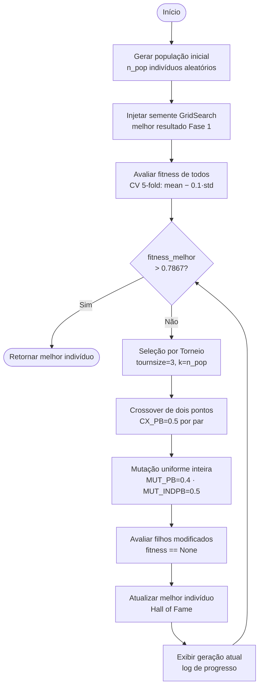

# Diagrama do Algoritmo Genético

Fluxo completo da execução do AG para otimização de hiperparâmetros do `RandomForestClassifier`.

## Cromossomo

Cada indivíduo é uma lista de 5 genes que codificam os hiperparâmetros do modelo:

| Gene | Hiperparâmetro       | Tipo       | Intervalo / Opções        |
|------|----------------------|------------|---------------------------|
| [0]  | `n_estimators`       | inteiro    | 20 – 60                   |
| [1]  | `max_depth`          | categórico | 5, 10, 15, 20, 25         |
| [2]  | `min_samples_leaf`   | inteiro    | 1 – 10                    |
| [3]  | `min_samples_split`  | inteiro    | 2 – 20                    |
| [4]  | `max_features`       | binário    | 0 = `sqrt`, 1 = `log2`    |

## Função de Fitness

$$\text{fitness} = \overline{\text{CV}} - 0.1 \times \sigma_{\text{CV}}$$

Penalizar o desvio padrão premia modelos acurados e estáveis entre os folds.

## Parâmetros do AG

| Parâmetro    | Valor | Descrição                                          |
|--------------|-------|----------------------------------------------------|
| `n_pop`      | 20    | Tamanho da população (padrão)                      |
| `CX_PB`      | 0.5   | Probabilidade de crossover entre dois indivíduos   |
| `MUT_PB`     | 0.4   | Probabilidade de um indivíduo sofrer mutação       |
| `MUT_INDPB`  | 0.5   | Probabilidade de mutar cada gene individualmente   |
| `tournsize`  | 3     | Candidatos por torneio na seleção                  |
| Meta CV      | 0.7867 | Acurácia CV 5-fold do GridSearch da Fase 1        |
