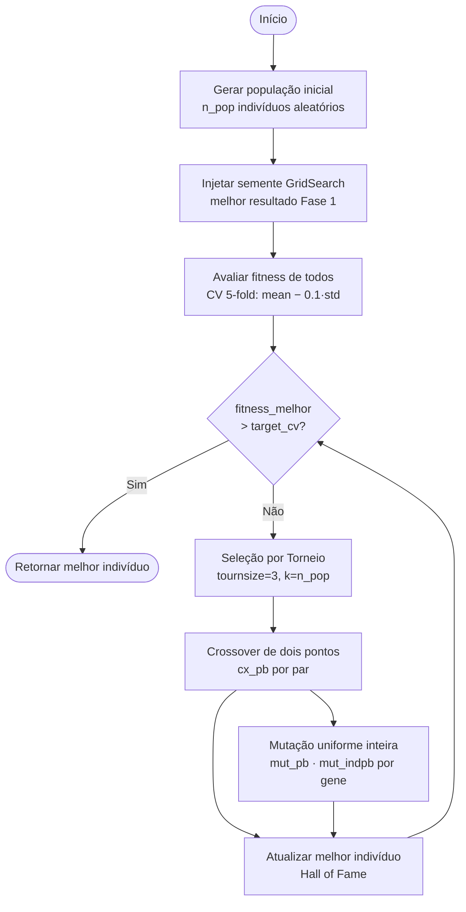

# Diagrama do Algoritmo Genético

Critério de parada: `cv_acc > target_cv`, onde `target_cv = PHASE1_CV_ACCURACY × (1 + target_improvement)`.

## Indivíduo

Cada indivíduo é uma lista de 5 genes que codificam os hiperparâmetros do modelo:

| Gene | Hiperparâmetro       | Tipo       | Intervalo / Opções        | Descrição
|------|----------------------|------------|---------------------------|------------------------------------------------------------------|
| [0]  | `n_estimators`       | inteiro    | 20 – 60                   | Quantidade de árvores                                            |
| [1]  | `max_depth`          | categórico | 5, 10, 15, 20, 25         | Profundidade máxima das árvores                                  |
| [2]  | `min_samples_leaf`   | inteiro    | 1 – 10                    | Quantidade mínima de amostras por folhas                         |
| [3]  | `min_samples_split`  | inteiro    | 2 – 20                    | Número mínimo de amostras necessárias para dividir um nó interno |
| [4]  | `max_features`       | binário    | 0 = `sqrt`, 1 = `log2`    | Quantas variáveis considerar por divisão                         |

## Função de Fitness

$$\text{fitness} = \overline{\text{CV}} - 0.1 \times \sigma_{\text{CV}}$$

Penalizar o desvio padrão premia modelos acurados e estáveis entre os folds.

## Parâmetros Padrão do AG

| Parâmetro    | Valor | Descrição                                          |
|--------------|-------|----------------------------------------------------|
| `n_pop`              | 10       | Tamanho da população (padrão)                                                    |
| `cx_pb`              | 1.0      | Probabilidade de crossover entre dois indivíduos *(configurável)*               |
| `mut_pb`             | 0.6      | Probabilidade de um indivíduo sofrer mutação *(configurável)*                   |
| `mut_indpb`          | 0.5      | Probabilidade de mutar cada gene individualmente *(configurável)*               |
| `tournsize`          | 3        | Candidatos por torneio na seleção                                               |
| `target_improvement` | 0.0      | Melhoria % desejada sobre a meta base (0.0 = apenas superar 0.7867) *(configurável)* |
| Meta base (CV)       | 0.7867   | Acurácia CV 5-fold do GridSearch da Fase 1                                      |
| `target_cv`          | dinâmica | `PHASE1_CV_ACCURACY × (1 + target_improvement)` — critério de parada            |
